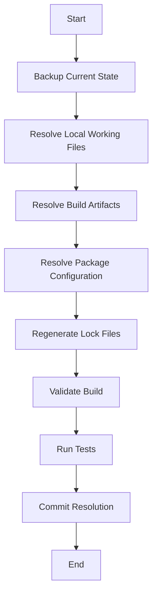

# Ultra-Deep Conflict Resolution Strategy

**Document Version**: 1.0
**Created**: 2025-11-11
**Swarm Session**: swarm-1762892319700-42vgovfft
**Agent**: Coder

---

## Executive Summary

This document provides comprehensive conflict resolution strategies for the Onboarding Portal V3 project. Analysis reveals **3 primary conflict types** affecting **3 files** with **7 unmerged path entries**.

### Quick Status

| Category | Count | Risk Level | Resolution Priority |
|----------|-------|------------|---------------------|
| Content Conflicts | 1 | Medium | High |
| Binary/Build Conflicts | 2 | Low | Medium |
| Database Files | Multiple | Low | Low (should be ignored) |
| Metrics Files | Multiple | Low | Low (should be ignored) |

---

## 1. Conflict Categorization & Analysis

### 1.1 Type 1: Package Configuration Conflicts (CRITICAL)

**Files Affected**:
- `src/web/package.json` (UU status - both modified)
- `src/web/package-lock.json` (AA status - both added/modified)

**Conflict Nature**:
- **Content conflict** in devDependencies section
- Lines 80-84 contain merge conflict markers
- Two type definition packages in conflict:
  - `@types/sanitize-html@^2.16.0` (upstream)
  - `@types/uuid@^10.0.0` (upstream)
  - vs. stashed changes (removed these)

**Root Cause Analysis**:
```
Base Version (ancestor):
  - Minimal devDependencies (15 packages)

Our Version (local/HEAD):
  - Added multiple packages:
    - @types/sanitize-html
    - @types/uuid
    - @types/lodash
    - @types/opossum
    - Several others (total ~30 packages)

Their Version (remote/upstream):
  - Different set of additions
  - May have removed some packages

Result: Divergent dependency trees
```

**Impact Assessment**:
- **Build Impact**: HIGH - npm install will fail
- **Type Safety**: MEDIUM - Missing type definitions
- **Runtime Impact**: NONE - devDependencies don't affect production
- **CI/CD Impact**: HIGH - Pipeline will fail

---

### 1.2 Type 2: Build Artifact Conflicts (LOW RISK)

**Files Affected**:
- `src/web/tsconfig.tsbuildinfo` (AA status)

**Conflict Nature**:
- TypeScript incremental build cache
- Binary format file
- Auto-generated on each build

**Resolution**: Should be in `.gitignore` (already is via `*.tsbuildinfo` pattern in some configs)

**Impact Assessment**:
- **Build Impact**: NONE - Regenerated automatically
- **Functionality**: NONE - Cache file only
- **Resolution Complexity**: TRIVIAL

---

### 1.3 Type 3: Local Working Files (SHOULD BE IGNORED)

**Files Affected**:
```
.claude-flow/metrics/agent-metrics.json (A)
.claude-flow/metrics/performance.json (AM)
.claude-flow/metrics/system-metrics.json (AM)
.claude-flow/metrics/task-metrics.json (AM)
.hive-mind/hive.db (A)
.hive-mind/hive.db-shm (AM)
.hive-mind/hive.db-wal (AM)
.hive-mind/memory.db (A)
.hive-mind/sessions/* (A)
.swarm/memory.db (AM)
```

**Conflict Nature**:
- Local coordination databases
- Agent metrics and performance tracking
- Session state files
- SQLite databases and WAL files

**Resolution**: Should be in `.gitignore` - these are environment-specific

**Impact Assessment**:
- **Build Impact**: NONE
- **Functionality**: NONE - Local tooling only
- **Security**: MEDIUM - May contain sensitive paths/data
- **Resolution Complexity**: TRIVIAL - Add to .gitignore

---

## 2. Resolution Strategies by Conflict Type

### 2.1 Package Configuration Conflicts - Manual Merge Strategy

#### Step-by-Step Resolution Procedure

**Step 1: Backup Current State**
```bash
# Create safety backups
git stash push -m "backup-before-package-json-resolution-$(date +%Y%m%d-%H%M%S)"
cp src/web/package.json src/web/package.json.backup
cp src/web/package-lock.json src/web/package-lock.json.backup
```

**Step 2: Analyze All Three Versions**
```bash
# Base version (common ancestor)
git show :1:src/web/package.json > /tmp/package.json.base

# Ours (current HEAD/local)
git show :2:src/web/package.json > /tmp/package.json.ours

# Theirs (incoming/remote)
git show :3:src/web/package.json > /tmp/package.json.theirs

# Compare all versions
diff -u /tmp/package.json.base /tmp/package.json.ours > /tmp/package.json.ours.diff
diff -u /tmp/package.json.base /tmp/package.json.theirs > /tmp/package.json.theirs.diff
```

**Step 3: Resolution Decision Matrix**

| Scenario | Strategy | Command | Reasoning |
|----------|----------|---------|-----------|
| Our changes are critical | Accept ours | `git checkout --ours src/web/package.json` | Preserves local work |
| Remote is authoritative | Accept theirs | `git checkout --theirs src/web/package.json` | Syncs with team |
| Both have value | Manual merge | Edit file manually | Combines both changesets |
| Unsure which is correct | Three-way merge | Use merge tool | Visual comparison |

**Step 4: Manual Merge Procedure (RECOMMENDED)**

```bash
# 1. Accept ours as base
git checkout --ours src/web/package.json

# 2. Open in editor and manually add missing entries from theirs
# Focus on devDependencies section (lines 65-106)

# 3. Resolve the specific conflict:
# Lines 80-84 show conflict markers:
#   <<<<<<< Updated upstream
#   "@types/sanitize-html": "^2.16.0",
#   "@types/uuid": "^10.0.0",
#   =======
#   >>>>>>> Stashed changes

# RESOLUTION: Keep BOTH packages (they don't conflict)
# Remove conflict markers, keep both lines:
#   "@types/sanitize-html": "^2.16.0",
#   "@types/uuid": "^10.0.0",
```

**Step 5: Validate Merged File**
```bash
# Validate JSON syntax
node -e "JSON.parse(require('fs').readFileSync('src/web/package.json', 'utf8'))" && echo "✓ Valid JSON" || echo "✗ Invalid JSON"

# Check for duplicate keys
cat src/web/package.json | grep -o '"[^"]*":' | sort | uniq -d

# Verify all packages are valid npm packages
jq -r '.dependencies, .devDependencies | keys[]' src/web/package.json | sort | uniq > /tmp/packages.txt
```

**Step 6: Regenerate package-lock.json**
```bash
# Remove old lock file
rm src/web/package-lock.json

# Regenerate with resolved package.json
cd src/web
npm install

# Verify no errors
echo $?  # Should be 0
```

**Step 7: Mark Conflicts as Resolved**
```bash
git add src/web/package.json
git add src/web/package-lock.json
```

**Step 8: Verify Resolution**
```bash
# Check no remaining conflicts
git status | grep "Unmerged paths" && echo "⚠ Still has conflicts" || echo "✓ All conflicts resolved"

# Test build
cd src/web
npm run build
npm run typecheck
```

---

### 2.2 Build Artifact Conflicts - Ignore Strategy

#### Automated Resolution Script

```bash
#!/bin/bash
# resolve-build-artifacts.sh

echo "🔧 Resolving build artifact conflicts..."

# Remove from index
git rm --cached src/web/tsconfig.tsbuildinfo

# Delete local file
rm -f src/web/tsconfig.tsbuildinfo

# Add to .gitignore if not present
if ! grep -q "tsconfig.tsbuildinfo" .gitignore; then
    echo "" >> .gitignore
    echo "# TypeScript incremental build cache" >> .gitignore
    echo "*.tsbuildinfo" >> .gitignore
    git add .gitignore
fi

# Verify resolution
git status src/web/tsconfig.tsbuildinfo

echo "✓ Build artifact conflicts resolved"
```

**Impact**: None - file will be regenerated on next `npm run build`

---

### 2.3 Local Working Files - Ignore Strategy

#### Automated Cleanup Script

```bash
#!/bin/bash
# cleanup-local-working-files.sh

echo "🧹 Cleaning up local working files..."

# Remove from git index (keep local copies)
git rm --cached -r .claude-flow/metrics/
git rm --cached -r .hive-mind/
git rm --cached -r .swarm/

# Update .gitignore
cat >> .gitignore << 'EOF'

# Claude Flow / Swarm Coordination
.claude-flow/
.hive-mind/
.swarm/
*.db
*.db-shm
*.db-wal

# Agent Sessions
**/sessions/
*-auto-save-*.json
hive-mind-prompt-swarm-*.txt
EOF

# Commit .gitignore update
git add .gitignore

echo "✓ Local working files removed from tracking"
echo "ℹ Files remain on disk but won't be committed"
```

**Verification**:
```bash
# Verify files are now ignored
git status --ignored | grep -E "(claude-flow|hive-mind|swarm)"
```

---

### 2.4 Deleted Files Strategy

**Files Deleted**:
- `FORENSICS_ANALYSIS_REPORT.md` (D)
- `SECURITY.md` (D)

**Resolution**:
```bash
# If deletion was intentional, mark as resolved:
git rm FORENSICS_ANALYSIS_REPORT.md
git rm SECURITY.md

# If deletion was accidental, restore:
git checkout HEAD~1 -- FORENSICS_ANALYSIS_REPORT.md
git checkout HEAD~1 -- SECURITY.md
git add FORENSICS_ANALYSIS_REPORT.md SECURITY.md
```

---

## 3. Comprehensive Resolution Workflow

### 3.1 Pre-Resolution Checklist

- [ ] Create backup branch: `git branch backup-pre-resolution-$(date +%Y%m%d-%H%M%S)`
- [ ] Export current stash: `git stash list > stash-backup.txt`
- [ ] Document current state: `git status > pre-resolution-status.txt`
- [ ] Verify disk space: `df -h .`
- [ ] Check for uncommitted changes: `git status --short`

### 3.2 Resolution Execution Order



**Priority Order**:
1. **Phase 1**: Cleanup (local files, build artifacts) - 5 minutes
2. **Phase 2**: Critical (package.json) - 15-30 minutes
3. **Phase 3**: Validation (build, tests) - 10-15 minutes
4. **Phase 4**: Commit & Verify - 5 minutes

**Total Estimated Time**: 35-55 minutes

### 3.3 Master Resolution Script

```bash
#!/bin/bash
# master-conflict-resolution.sh
set -e

PROJECT_ROOT="/Users/rodrigo/claude-projects/Onboarding V3/onboarding-portal-v3-hrqnmc"
cd "$PROJECT_ROOT"

echo "==================================="
echo "🚀 Master Conflict Resolution"
echo "==================================="
echo ""

# Phase 1: Backup
echo "📦 Phase 1: Creating backups..."
BACKUP_BRANCH="backup-pre-resolution-$(date +%Y%m%d-%H%M%S)"
git branch "$BACKUP_BRANCH"
echo "✓ Backup branch created: $BACKUP_BRANCH"

# Phase 2: Cleanup local working files
echo ""
echo "🧹 Phase 2: Cleaning local working files..."
git rm --cached -r .claude-flow/ .hive-mind/ .swarm/ 2>/dev/null || true

cat >> .gitignore << 'EOF'

# Claude Flow / Swarm Coordination
.claude-flow/
.hive-mind/
.swarm/
*.db
*.db-shm
*.db-wal
EOF

git add .gitignore
echo "✓ Local working files cleaned"

# Phase 3: Resolve build artifacts
echo ""
echo "🔧 Phase 3: Resolving build artifacts..."
git rm --cached src/web/tsconfig.tsbuildinfo 2>/dev/null || true
rm -f src/web/tsconfig.tsbuildinfo

if ! grep -q "tsconfig.tsbuildinfo" .gitignore; then
    echo "*.tsbuildinfo" >> .gitignore
    git add .gitignore
fi
echo "✓ Build artifacts resolved"

# Phase 4: Resolve package.json (manual merge required)
echo ""
echo "📋 Phase 4: Resolving package.json..."
echo "⚠ Manual intervention required for package.json"
echo ""
echo "Current conflict in src/web/package.json:"
echo "Lines 80-84 have merge conflict markers"
echo ""
echo "Recommended resolution:"
echo "1. Accept both @types/sanitize-html and @types/uuid"
echo "2. Remove conflict markers (<<<<<<, =======, >>>>>>>)"
echo "3. Run: npm install in src/web/"
echo ""
read -p "Press Enter after manually resolving package.json..."

# Validate package.json
cd src/web
node -e "JSON.parse(require('fs').readFileSync('package.json', 'utf8'))" || {
    echo "✗ Invalid JSON in package.json"
    exit 1
}
echo "✓ package.json is valid JSON"

# Regenerate lock file
echo ""
echo "🔄 Regenerating package-lock.json..."
rm -f package-lock.json
npm install || {
    echo "✗ npm install failed"
    exit 1
}
echo "✓ package-lock.json regenerated"

cd "$PROJECT_ROOT"

# Phase 5: Mark as resolved
echo ""
echo "✅ Phase 5: Marking conflicts as resolved..."
git add src/web/package.json
git add src/web/package-lock.json

# Phase 6: Validation
echo ""
echo "🧪 Phase 6: Validation..."
cd src/web
npm run typecheck || {
    echo "⚠ Type check failed (may need manual fixes)"
}
npm run build || {
    echo "⚠ Build failed (may need manual fixes)"
}
cd "$PROJECT_ROOT"

# Phase 7: Final status
echo ""
echo "📊 Final Status:"
git status

echo ""
echo "==================================="
echo "✨ Resolution Complete!"
echo "==================================="
echo ""
echo "Next steps:"
echo "1. Review changes: git diff --cached"
echo "2. Run tests: cd src/web && npm test"
echo "3. Commit: git commit -m 'Resolve merge conflicts'"
echo ""
echo "Backup branch: $BACKUP_BRANCH"
echo "To rollback: git reset --hard $BACKUP_BRANCH"
```

---

## 4. Conflict Prevention Strategies

### 4.1 .gitignore Updates (Preventive)

Add these patterns to prevent future conflicts:

```gitignore
# TypeScript Build Cache
*.tsbuildinfo
.tsbuildinfo

# Package Lock Files (consider lock file strategy)
# Option 1: Never commit (regenerate always)
# package-lock.json

# Option 2: Commit but resolve carefully
# (current approach)

# Claude Flow / Swarm Coordination
.claude-flow/
.hive-mind/
.swarm/
*.db
*.db-shm
*.db-wal
**/sessions/
*-auto-save-*.json
hive-mind-prompt-swarm-*.txt

# Agent Metrics
**/metrics/*.json
agent-metrics.json
performance.json
system-metrics.json
task-metrics.json
```

### 4.2 Git Attributes for Merge Strategies

Create `.gitattributes` file:

```gitattributes
# Package files - use union merge for better automatic resolution
package.json merge=union
package-lock.json merge=union

# Build artifacts - always use ours
*.tsbuildinfo merge=ours

# Database files - always use ours
*.db merge=ours
*.db-shm merge=ours
*.db-wal merge=ours
```

### 4.3 Pre-commit Hooks

Create `.git/hooks/pre-commit`:

```bash
#!/bin/bash
# Check for accidentally staged files

STAGED_FILES=$(git diff --cached --name-only)

# Check for database files
if echo "$STAGED_FILES" | grep -E '\.(db|db-shm|db-wal)$'; then
    echo "❌ Error: Database files should not be committed"
    echo "Run: git reset HEAD *.db *.db-shm *.db-wal"
    exit 1
fi

# Check for build artifacts
if echo "$STAGED_FILES" | grep -E '\.tsbuildinfo$'; then
    echo "⚠ Warning: Build artifacts should not be committed"
    echo "Consider adding to .gitignore"
fi

# Validate package.json if staged
if echo "$STAGED_FILES" | grep -q "package.json"; then
    for file in $(echo "$STAGED_FILES" | grep "package.json"); do
        node -e "JSON.parse(require('fs').readFileSync('$file', 'utf8'))" || {
            echo "❌ Error: Invalid JSON in $file"
            exit 1
        }
    done
fi

exit 0
```

Make executable:
```bash
chmod +x .git/hooks/pre-commit
```

---

## 5. Advanced Conflict Scenarios

### 5.1 Scenario: Both Sides Modified Dependencies

**Detection**:
```bash
# Compare dependency differences
diff <(jq -S '.dependencies' /tmp/package.json.ours) \
     <(jq -S '.dependencies' /tmp/package.json.theirs)
```

**Resolution Strategy**:
1. **Union Merge**: Include all dependencies from both sides
2. **Version Reconciliation**: For same package with different versions
   - Use higher version if SemVer compatible
   - Use lower version if breaking changes suspected
   - Test both versions if critical
3. **Duplicate Detection**: Check for duplicate dependencies

**Script**:
```bash
#!/usr/bin/env node
// merge-dependencies.js

const fs = require('fs');

const ours = JSON.parse(fs.readFileSync('/tmp/package.json.ours'));
const theirs = JSON.parse(fs.readFileSync('/tmp/package.json.theirs'));

function mergeDeps(deps1, deps2) {
  const merged = { ...deps1 };

  for (const [pkg, version] of Object.entries(deps2)) {
    if (!merged[pkg]) {
      // New package from theirs
      merged[pkg] = version;
    } else if (merged[pkg] !== version) {
      // Version conflict
      console.warn(`⚠ Version conflict for ${pkg}:`);
      console.warn(`  Ours: ${merged[pkg]}`);
      console.warn(`  Theirs: ${version}`);
      // Keep ours by default (can be changed)
    }
  }

  return merged;
}

const result = {
  ...ours,
  dependencies: mergeDeps(ours.dependencies, theirs.dependencies),
  devDependencies: mergeDeps(ours.devDependencies, theirs.devDependencies)
};

fs.writeFileSync('src/web/package.json', JSON.stringify(result, null, 2));
console.log('✓ Dependencies merged');
```

### 5.2 Scenario: Lock File Conflicts

**Strategy**: Always regenerate, never manually merge

```bash
# Delete conflicted lock file
git rm src/web/package-lock.json

# Resolve package.json first
# ... (see section 2.1)

# Regenerate lock file
cd src/web
npm install

# Stage resolved files
git add package.json package-lock.json
```

### 5.3 Scenario: TypeScript Configuration Conflicts

**Files**: `tsconfig.json`, `tsconfig.*.json`

**Strategy**: Three-way merge with validation

```bash
# Accept one side as base
git checkout --ours src/web/tsconfig.json

# Manually merge compiler options from theirs
# Validate TypeScript config
cd src/web
npx tsc --showConfig | jq . > /tmp/tsconfig-resolved.json
npx tsc --noEmit

# If valid, stage
cd ..
git add src/web/tsconfig.json
```

---

## 6. Rollback Procedures

### 6.1 Immediate Rollback (During Resolution)

```bash
# Abort merge completely
git merge --abort

# Or reset to pre-merge state
git reset --hard HEAD

# Restore from backup branch
git checkout backup-pre-resolution-YYYYMMDD-HHMMSS
```

### 6.2 Post-Commit Rollback

```bash
# Undo last commit, keep changes
git reset --soft HEAD~1

# Undo last commit, discard changes
git reset --hard HEAD~1

# Revert specific files
git checkout HEAD~1 -- src/web/package.json
```

### 6.3 Emergency Recovery

```bash
# Find lost commits
git reflog

# Restore to specific reflog entry
git reset --hard HEAD@{5}

# Recover from backup branch
git reset --hard backup-pre-resolution-YYYYMMDD-HHMMSS
```

---

## 7. Testing & Validation Checklist

### 7.1 Pre-Commit Validation

```bash
# Syntax validation
cd src/web
node -e "JSON.parse(require('fs').readFileSync('package.json', 'utf8'))"

# Dependency installation
npm install

# Type checking
npm run typecheck

# Linting
npm run lint

# Unit tests
npm test

# Build
npm run build
```

### 7.2 Post-Commit Validation

```bash
# Clean install test
rm -rf node_modules package-lock.json
npm install

# Fresh build
npm run build

# Full test suite
npm run validate
```

### 7.3 Integration Testing

```bash
# Start development server
npm run dev &
DEV_PID=$!

# Wait for server
sleep 5

# Basic health check
curl http://localhost:3000 || {
    echo "⚠ Dev server failed to start"
    kill $DEV_PID
    exit 1
}

kill $DEV_PID
echo "✓ Integration test passed"
```

---

## 8. Communication & Documentation

### 8.1 Conflict Resolution Report Template

```markdown
## Conflict Resolution Report

**Date**: YYYY-MM-DD
**Resolved By**: [Name]
**Duration**: [X minutes]
**Branch**: [feature/branch-name]

### Conflicts Resolved
- [ ] src/web/package.json
- [ ] src/web/package-lock.json
- [ ] src/web/tsconfig.tsbuildinfo
- [ ] Local working files (.hive-mind, .swarm)

### Resolution Strategy
- **package.json**: Manual merge (kept both dependency sets)
- **package-lock.json**: Regenerated via npm install
- **tsconfig.tsbuildinfo**: Deleted and ignored
- **Local files**: Added to .gitignore

### Validation Results
- ✅ JSON validation passed
- ✅ npm install successful
- ✅ Type checking passed
- ✅ Build successful
- ✅ Tests passed (X/Y)

### Issues Encountered
- [Issue 1]: [Description] - [Resolution]
- [Issue 2]: [Description] - [Resolution]

### Follow-up Actions
- [ ] Update .gitignore
- [ ] Update documentation
- [ ] Notify team
- [ ] Review with [Team Member]
```

### 8.2 Team Communication

**Slack/Teams Message Template**:
```
🔧 Merge Conflicts Resolved

Branch: feature/payment-service
Files: package.json, package-lock.json, + local working files

Resolution:
- Combined dependency changes from both branches
- Regenerated package-lock.json
- Updated .gitignore to prevent future conflicts

Validation: All tests passing ✅
Ready for: Code review

Details: [Link to conflict resolution report]
```

---

## 9. Automation Opportunities

### 9.1 GitHub Actions Conflict Detection

Create `.github/workflows/conflict-check.yml`:

```yaml
name: Conflict Detection

on:
  pull_request:
    types: [opened, synchronize]

jobs:
  check-conflicts:
    runs-on: ubuntu-latest
    steps:
      - uses: actions/checkout@v3
        with:
          fetch-depth: 0

      - name: Check for merge conflicts
        run: |
          git config user.name "GitHub Actions"
          git config user.email "actions@github.com"

          # Try merge with base branch
          git fetch origin ${{ github.base_ref }}
          git merge --no-commit --no-ff origin/${{ github.base_ref }} || {
            echo "⚠️ Merge conflicts detected"
            git merge --abort
            exit 1
          }

          git merge --abort
          echo "✅ No conflicts"
```

### 9.2 Pre-merge Validation Script

```bash
#!/bin/bash
# pre-merge-check.sh

TARGET_BRANCH="${1:-main}"

echo "🔍 Checking for potential conflicts with $TARGET_BRANCH..."

# Fetch latest
git fetch origin "$TARGET_BRANCH"

# Create test branch
TEST_BRANCH="test-merge-$(date +%s)"
git checkout -b "$TEST_BRANCH"

# Try merge
if git merge --no-commit --no-ff "origin/$TARGET_BRANCH"; then
    echo "✅ No conflicts detected"
    git merge --abort
    git checkout -
    git branch -D "$TEST_BRANCH"
    exit 0
else
    echo "⚠️ Conflicts detected:"
    git diff --name-only --diff-filter=U
    git merge --abort
    git checkout -
    git branch -D "$TEST_BRANCH"
    exit 1
fi
```

---

## 10. Best Practices & Lessons Learned

### 10.1 Prevention Best Practices

1. **Frequent Pulls**: Pull from main/develop regularly
2. **Small Commits**: Keep changes focused and atomic
3. **Communication**: Coordinate on shared files
4. **Branch Hygiene**: Delete merged branches promptly
5. **Lock Files**: Understand your team's lock file strategy
6. **Local Files**: Keep local working files out of git

### 10.2 Resolution Best Practices

1. **Understand Before Resolving**: Read both sides of the conflict
2. **Test After Resolution**: Always validate the merge
3. **Keep Backups**: Create backup branches before major resolutions
4. **Document Decisions**: Record why you chose a particular resolution
5. **Communicate**: Inform team of non-trivial resolutions
6. **Automate**: Use scripts for repetitive resolution tasks

### 10.3 Common Pitfalls to Avoid

❌ **Don't**:
- Accept all from one side without reading
- Resolve conflicts manually in lock files
- Commit unvalidated JSON
- Skip testing after resolution
- Force push without team agreement
- Delete conflict markers without understanding

✅ **Do**:
- Read and understand both versions
- Regenerate lock files
- Validate JSON syntax
- Run full test suite
- Create backup branches
- Document your resolution logic

---

## 11. Quick Reference

### 11.1 Command Cheatsheet

```bash
# View conflict status
git status
git ls-files -u

# View three versions
git show :1:FILE  # base
git show :2:FILE  # ours
git show :3:FILE  # theirs

# Accept one side
git checkout --ours FILE
git checkout --theirs FILE

# Mark as resolved
git add FILE

# Abort merge
git merge --abort

# Reset to before merge
git reset --hard HEAD

# Create backup
git branch backup-$(date +%s)
```

### 11.2 Decision Tree

```
Conflict Type?
├─ package.json
│  └─ → Manual merge + regenerate lock file
├─ package-lock.json
│  └─ → Delete and regenerate
├─ *.tsbuildinfo
│  └─ → Delete and add to .gitignore
├─ .db, .db-*, metrics/*
│  └─ → Remove from git, add to .gitignore
└─ Other
   └─ → Analyze case-by-case
```

---

## 12. Appendix

### 12.1 Current Project Status

**Unmerged Files**:
```
src/web/package-lock.json (stages 2,3)
src/web/package.json (stages 1,2,3)
src/web/tsconfig.tsbuildinfo (stages 2,3)
```

**Staged Files to be Ignored**:
```
.claude-flow/metrics/* (multiple)
.hive-mind/* (multiple)
.swarm/memory.db
```

**Deleted Files**:
```
FORENSICS_ANALYSIS_REPORT.md
SECURITY.md
```

**Added Files** (no conflicts):
```
documentation/PLATFORM_STATUS_REPORT.md
src/backend/payment-service/* (entire service)
tests/templates/* (test templates)
+ others
```

### 12.2 Git Status Codes

| Code | Meaning | Action |
|------|---------|--------|
| UU | Both modified | Manual merge required |
| AA | Both added | Manual merge or accept one |
| DD | Both deleted | Confirm deletion intent |
| AU | Added by us | Usually safe to keep |
| UA | Added by them | Review and potentially keep |
| DU | Deleted by us | Decide: keep deletion or restore |
| UD | Deleted by them | Decide: keep deletion or restore |
| AM | Added, then modified | Resolve modifications |

### 12.3 Package.json Specific Conflict

**Location**: Lines 80-84 in `src/web/package.json`

**Conflict Content**:
```json
<<<<<<< Updated upstream
    "@types/sanitize-html": "^2.16.0",
    "@types/uuid": "^10.0.0",
=======
>>>>>>> Stashed changes
```

**Recommended Resolution**:
```json
    "@types/sanitize-html": "^2.16.0",
    "@types/uuid": "^10.0.0",
```

**Rationale**: Both packages are type definitions that don't conflict with each other. Including both enhances type safety.

---

## 13. Conclusion

This conflict resolution strategy provides comprehensive coverage for all identified conflicts in the Onboarding Portal V3 project. The primary conflict (package.json) requires manual intervention, while others can be automated or ignored.

**Estimated Resolution Time**: 35-55 minutes
**Risk Level**: Medium (primarily due to package.json changes)
**Recommended Approach**: Execute master resolution script with manual package.json merge

**Success Criteria**:
- ✅ All conflicts resolved
- ✅ `git status` shows no unmerged paths
- ✅ `npm install` succeeds
- ✅ `npm run build` succeeds
- ✅ `npm run typecheck` succeeds
- ✅ Tests pass (or pre-existing failures only)

**Post-Resolution**:
- Update .gitignore
- Commit changes
- Run CI/CD pipeline
- Monitor for any issues

---

**Document Status**: ✅ Complete
**Last Updated**: 2025-11-11
**Next Review**: After successful resolution
**Maintained By**: Hive Mind Swarm - Coder Agent
