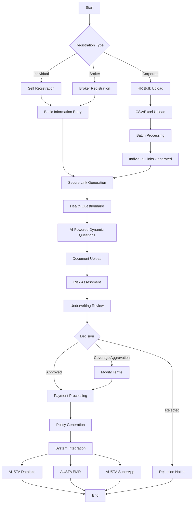
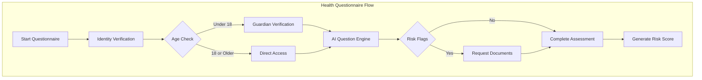
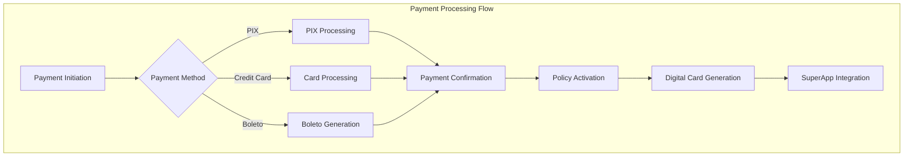
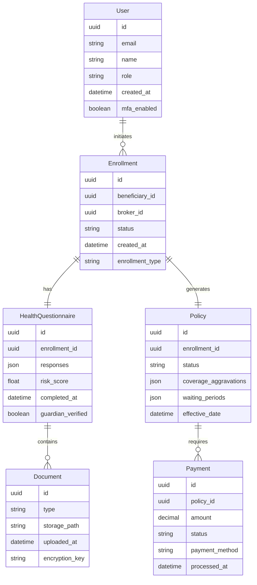
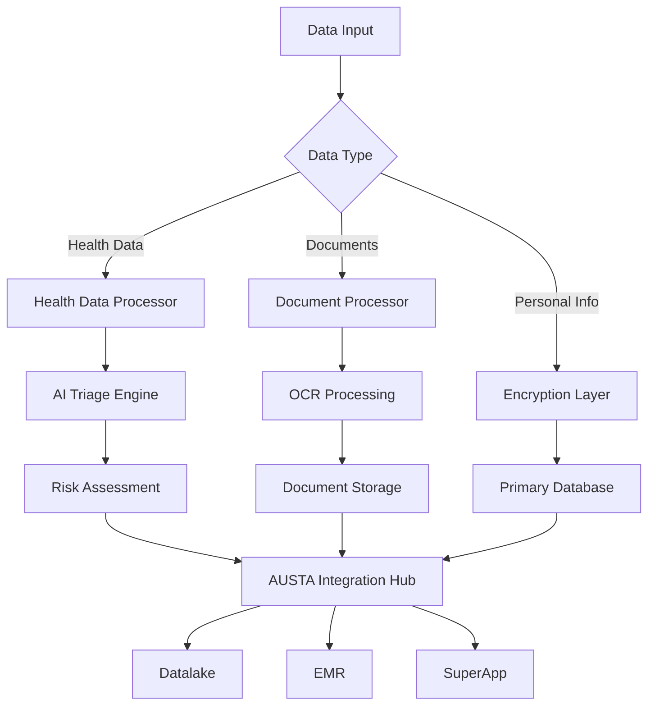
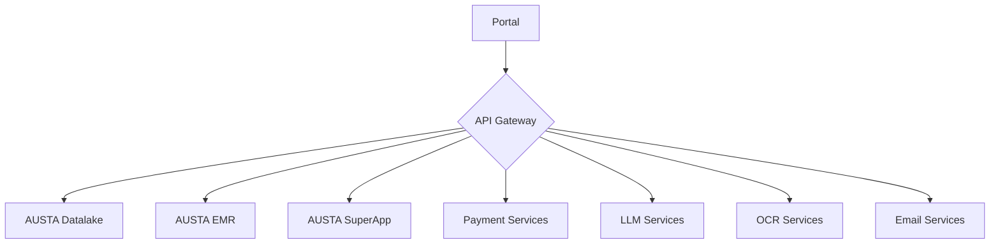
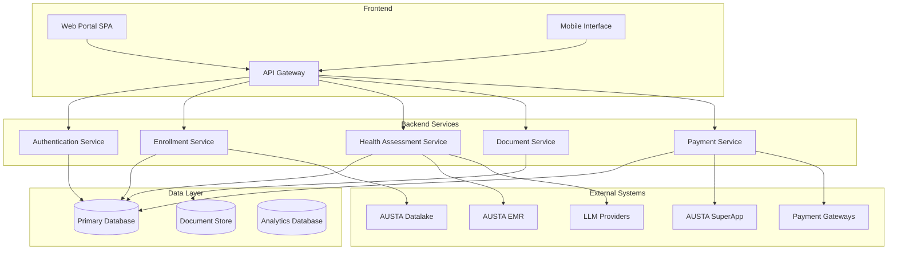

# Product Requirements Document (PRD)

# 1. INTRODUCTION

## 1.1 Purpose

This Software Requirements Specification (SRS) document provides a comprehensive description of the Pre-paid Health Plan Onboarding Portal. It details the functional and non-functional requirements for all stakeholders involved in the development, implementation, and maintenance of the system, including software developers, QA engineers, project managers, and AUSTA's technical teams.

## 1.2 Scope

The Pre-paid Health Plan Onboarding Portal is a web-based system that automates and streamlines the enrollment process for new health plan beneficiaries. The system encompasses:

- Role-based user management for brokers, HR personnel, individual beneficiaries, parents/guardians, underwriting team, and administrators
- AI-powered dynamic health questionnaire with multi-LLM integration
- Secure document and data storage with complete encryption
- Integration with AUSTA's ecosystem (Datalake, EMR, and SuperApp)
- Automated policy issuance and payment processing
- Corporate bulk enrollment capabilities

Key benefits include:
- Reduction in manual processing time and data entry errors
- Enhanced data security and LGPD compliance
- Streamlined risk assessment through AI triage
- Unified data flow across AUSTA's healthcare platforms
- Improved user experience for all stakeholders

The system will be developed using:
- Frontend: Single Page Application framework with role-based routing
- Backend: RESTful/GraphQL API with containerized architecture
- Storage: Encrypted database with document management
- AI Engine: Multi-LLM API integration
- Analytics: Built-in reporting and tracking module
- Payment: Integration with multiple payment gateways

# 2. PRODUCT DESCRIPTION

## 2.1 Product Perspective

The Pre-paid Health Plan Onboarding Portal operates as a critical component within AUSTA's broader healthcare ecosystem, interfacing with:

- AUSTA Datalake: Receives approved beneficiary data for analytics and population health insights
- AUSTA EMR: Synchronizes relevant medical information for care coordination
- AUSTA SuperApp: Provides policy details, membership cards, and access to digital health services
- Payment Gateways: Processes initial and recurring payments
- Multiple LLM Providers: Powers the AI-driven health questionnaire

## 2.2 Product Functions

- User Management and Authentication
  - Role-based access control
  - Multi-factor authentication for sensitive roles
  - Parent/guardian verification for minors

- Enrollment Processing
  - Individual beneficiary registration
  - Corporate bulk enrollment
  - Broker-assisted registration
  - Document upload and OCR processing

- Health Assessment
  - AI-powered dynamic questionnaire
  - Risk scoring and triage
  - Medical document management
  - Coverage aggravation determination

- Policy Management
  - Age-bracket based pricing
  - Waiting period calculation
  - Policy generation and distribution
  - Payment processing

- System Integration
  - Datalake data synchronization
  - EMR information exchange
  - SuperApp policy details sharing
  - Analytics and reporting

## 2.3 User Characteristics

| User Type | Technical Expertise | Usage Frequency | Key Requirements |
|-----------|-------------------|-----------------|------------------|
| Brokers | Moderate | Daily | Efficient data entry, status tracking |
| HR Personnel | Moderate | Weekly | Bulk upload capabilities, progress monitoring |
| Individual Beneficiaries | Low to Moderate | One-time | Simple interface, clear instructions |
| Parents/Guardians | Low to Moderate | One-time | Intuitive guardian verification |
| Underwriting Team | High | Daily | Comprehensive risk assessment tools |
| Administrators | High | Daily | Complete system control and monitoring |

## 2.4 Constraints

Technical Constraints:
- Must use containerized architecture for deployment
- Required 99.9% system availability
- Brazilian Portuguese language requirement for all interfaces
- LGPD compliance for data handling and storage

Regulatory Constraints:
- Strict separation of health data access
- Mandatory data retention periods
- Explicit consent requirements
- Right to be forgotten compliance

Business Constraints:
- Fixed pricing structure based on age brackets
- Predefined coverage aggravation rules
- Integration with existing AUSTA systems
- Standard waiting period policies

## 2.5 Assumptions and Dependencies

Assumptions:
- Stable internet connectivity for all users
- Browser compatibility with modern web standards
- Available technical support during business hours
- User access to required documentation for enrollment

Dependencies:
- AUSTA Datalake API availability
- EMR system uptime and integration readiness
- SuperApp compatibility
- LLM provider service reliability
- Payment gateway operational status
- OCR service availability for document processing
- Email/SMS service for notifications

# 3. PROCESS FLOWCHART

# 4. FUNCTIONAL REQUIREMENTS

## 4.1 User Management and Authentication

### ID: F001
### Description
Role-based access control system with multi-factor authentication for sensitive roles.
### Priority: High
### Requirements

| ID | Requirement | Priority |
|---|-------------|----------|
| F001.1 | Support registration and authentication for all user types (brokers, HR, beneficiaries, underwriting, admin) | High |
| F001.2 | Implement multi-factor authentication for underwriting and admin roles | High |
| F001.3 | Enable parent/guardian verification for users under 18 | High |
| F001.4 | Maintain audit logs of all authentication and authorization activities | Medium |
| F001.5 | Provide password reset and account recovery functionality | Medium |

## 4.2 Enrollment Processing

### ID: F002
### Description
Comprehensive enrollment system supporting individual and bulk registration processes.
### Priority: High
### Requirements

| ID | Requirement | Priority |
|---|-------------|----------|
| F002.1 | Support individual beneficiary self-registration workflow | High |
| F002.2 | Enable broker-assisted registration process | High |
| F002.3 | Implement corporate bulk enrollment via CSV/Excel upload | High |
| F002.4 | Provide OCR processing for uploaded identification documents | Medium |
| F002.5 | Generate unique secure links for health questionnaire completion | High |

## 4.3 Health Assessment

### ID: F003
### Description
AI-powered dynamic health questionnaire system with risk assessment capabilities.
### Priority: High
### Requirements

| ID | Requirement | Priority |
|---|-------------|----------|
| F003.1 | Implement multi-LLM integration for dynamic questioning | High |
| F003.2 | Calculate risk scores based on questionnaire responses | High |
| F003.3 | Support secure medical document upload and management | High |
| F003.4 | Flag potential coverage aggravations automatically | High |
| F003.5 | Maintain questionnaire session privacy and security | High |

## 4.4 Policy Management

### ID: F004
### Description
Automated policy generation and management system with payment processing.
### Priority: High
### Requirements

| ID | Requirement | Priority |
|---|-------------|----------|
| F004.1 | Calculate premiums based on age brackets | High |
| F004.2 | Process payments through multiple gateways (PIX, credit card, boleto) | High |
| F004.3 | Generate and distribute digital policy documents | High |
| F004.4 | Track and enforce waiting periods | High |
| F004.5 | Manage coverage aggravations and exclusions | High |

## 4.5 System Integration

### ID: F005
### Description
Integration with AUSTA's ecosystem components and external services.
### Priority: High
### Requirements

| ID | Requirement | Priority |
|---|-------------|----------|
| F005.1 | Sync approved beneficiary data with AUSTA Datalake | High |
| F005.2 | Share relevant medical information with AUSTA EMR | High |
| F005.3 | Push policy details and membership cards to AUSTA SuperApp | High |
| F005.4 | Generate analytics and reporting data | Medium |
| F005.5 | Maintain audit trails of all system integrations | Medium |

## 4.6 Document Management

### ID: F006
### Description
Secure document storage and management system with encryption.
### Priority: High
### Requirements

| ID | Requirement | Priority |
|---|-------------|----------|
| F006.1 | Store all documents with AES-256 encryption at rest | High |
| F006.2 | Implement role-based document access control | High |
| F006.3 | Support document versioning and history tracking | Medium |
| F006.4 | Provide document search and retrieval functionality | Medium |
| F006.5 | Enable secure document sharing between authorized users | Medium |

# 5. NON-FUNCTIONAL REQUIREMENTS

## 5.1 Performance Requirements

| ID | Requirement | Target Metric |
|----|-------------|---------------|
| P001 | API Response Time | 95% of requests < 500ms |
| P002 | Health Questionnaire Load Time | < 2 seconds initial load |
| P003 | Bulk Upload Processing | 1000 records < 5 minutes |
| P004 | Document Upload Size | Support up to 20MB per file |
| P005 | Concurrent Users | Support 5000+ simultaneous users |
| P006 | Database Query Performance | 99% of queries < 100ms |
| P007 | Payment Processing Time | < 3 seconds for transaction completion |

## 5.2 Safety Requirements

| ID | Requirement | Description |
|----|-------------|-------------|
| S001 | Data Backup | Automated hourly backups with 30-day retention |
| S002 | Disaster Recovery | Recovery Time Objective (RTO) < 4 hours |
| S003 | Failover Systems | Automatic failover to secondary systems |
| S004 | Data Integrity | Checksums for all stored documents |
| S005 | Session Management | Automatic timeout after 15 minutes of inactivity |
| S006 | Error Handling | Graceful degradation of services |
| S007 | Transaction Rollback | Automatic rollback for failed operations |

## 5.3 Security Requirements

| ID | Requirement | Description |
|----|-------------|-------------|
| SE001 | Authentication | Multi-factor authentication for sensitive roles |
| SE002 | Data Encryption | AES-256 encryption for data at rest |
| SE003 | Transport Security | TLS 1.3 for all data in transit |
| SE004 | Access Control | Role-based access control (RBAC) |
| SE005 | Audit Logging | Comprehensive audit trails for all actions |
| SE006 | Penetration Testing | Quarterly security assessments |
| SE007 | Data Masking | PII and health data masking in logs |
| SE008 | API Security | OAuth 2.0 and JWT implementation |

## 5.4 Quality Requirements

### 5.4.1 Availability
- System uptime: 99.9% excluding planned maintenance
- Planned maintenance windows: Between 00:00-04:00 BRT
- Maximum unplanned downtime: 43 minutes per month

### 5.4.2 Maintainability
- Modular architecture with microservices
- Automated deployment pipelines
- Comprehensive API documentation
- Code coverage minimum 80%

### 5.4.3 Usability
- Interface in Brazilian Portuguese
- Maximum 3 clicks to reach any function
- Mobile-responsive design
- WCAG 2.1 Level AA compliance
- Support for major browsers (Chrome, Firefox, Safari, Edge)

### 5.4.4 Scalability
- Horizontal scaling capability
- Auto-scaling based on load
- Database partitioning support
- Load balancing across multiple regions

### 5.4.5 Reliability
- Mean Time Between Failures (MTBF): > 720 hours
- Mean Time To Recovery (MTTR): < 1 hour
- Error rate: < 0.1% of all transactions
- Data consistency check mechanisms

## 5.5 Compliance Requirements

| ID | Requirement | Description |
|----|-------------|-------------|
| C001 | LGPD Compliance | Full compliance with Lei Geral de Proteção de Dados |
| C002 | Data Retention | Configurable retention periods per data type |
| C003 | Right to be Forgotten | Automated data deletion workflows |
| C004 | Consent Management | Explicit consent tracking and management |
| C005 | Audit Requirements | Regular compliance audits and reporting |
| C006 | Healthcare Standards | HL7 FHIR compliance for health data |
| C007 | Accessibility | WCAG 2.1 Level AA compliance |
| C008 | Data Portability | Export functionality for user data |

# 6. DATA REQUIREMENTS

## 6.1 Data Models

## 6.2 Data Storage

### 6.2.1 Storage Requirements

| Data Type | Storage Method | Encryption | Retention Period |
|-----------|---------------|------------|------------------|
| User Data | Primary Database | AES-256 | 5 years after last activity |
| Health Questionnaires | Primary Database | AES-256 | 20 years |
| Documents | Object Storage | AES-256 | 20 years |
| Payment Information | Payment Database | AES-256 | 5 years |
| Audit Logs | Log Database | AES-256 | 5 years |

### 6.2.2 Backup and Recovery

- Real-time replication across multiple availability zones
- Hourly incremental backups
- Daily full backups retained for 30 days
- Monthly backups retained for 1 year
- Annual backups retained for 20 years
- Recovery Time Objective (RTO): 4 hours
- Recovery Point Objective (RPO): 1 hour

### 6.2.3 Data Redundancy

- Multi-region database replication
- Active-active configuration for high availability
- Automatic failover mechanisms
- Data consistency checks with checksums
- Regular backup verification and restoration testing

## 6.3 Data Processing

### 6.3.1 Data Flow

### 6.3.2 Data Security

| Security Layer | Implementation |
|----------------|----------------|
| Transport | TLS 1.3 for all data in transit |
| Storage | AES-256 encryption at rest |
| Access Control | Role-based access with MFA |
| Key Management | AWS KMS or equivalent |
| Audit | Comprehensive logging of all data access |

### 6.3.3 Data Processing Rules

- Health data processing isolated in dedicated secure environment
- Real-time data validation before storage
- Automated PII detection and masking in logs
- Rate limiting for API endpoints
- Asynchronous processing for bulk operations
- Data transformation rules for system integration

## 6.4 Data Integration

### 6.4.1 External System Integration

| System | Data Direction | Format | Frequency |
|--------|---------------|---------|-----------|
| AUSTA Datalake | Outbound | JSON/HL7 FHIR | Real-time |
| AUSTA EMR | Bidirectional | HL7 FHIR | Real-time |
| AUSTA SuperApp | Outbound | JSON | Real-time |
| Payment Gateway | Bidirectional | JSON | Real-time |
| LLM Providers | Bidirectional | JSON | On-demand |

### 6.4.2 Data Synchronization

- Event-driven architecture for real-time updates
- Message queuing for asynchronous processing
- Retry mechanisms with exponential backoff
- Conflict resolution protocols
- Data validation at integration points

# 7. EXTERNAL INTERFACES

## 7.1 User Interfaces

### 7.1.1 General Requirements

- Brazilian Portuguese language for all interfaces
- Responsive design supporting desktop and mobile devices
- WCAG 2.1 Level AA compliance
- Maximum 3-click navigation to any function
- Consistent color scheme and branding aligned with AUSTA guidelines
- Support for major browsers (Chrome, Firefox, Safari, Edge)

### 7.1.2 Role-Specific Interfaces

| Role | Interface Components | Key Features |
|------|---------------------|--------------|
| Broker | Dashboard, Client Management, Application Tracking | - Client registration forms - Application status tracking - Commission reports - Search and filter capabilities |
| HR Personnel | Bulk Upload Interface, Employee Management | - CSV/Excel template upload - Progress monitoring dashboard - Employee status tracking - Bulk action tools |
| Individual Beneficiary | Registration, Health Questionnaire | - Step-by-step enrollment wizard - Dynamic health questionnaire - Document upload interface - Payment gateway integration |
| Parent/Guardian | Minor Registration, Guardian Verification | - Guardian verification workflow - Minor's health questionnaire - Document management for minors |
| Underwriting Team | Risk Assessment Dashboard | - AI triage results view - Risk scoring interface - Coverage aggravation tools - Policy modification controls |
| Administrator | System Configuration Panel | - User management console - System monitoring dashboard - Configuration controls - Audit logs viewer |

## 7.2 Hardware Interfaces

### 7.2.1 Document Scanning

| Component | Specification |
|-----------|--------------|
| Scanner Resolution | Minimum 300 DPI |
| File Format Support | PDF, JPEG, PNG |
| Interface Type | TWAIN compatible |
| OCR Compatibility | Required for document processing |

### 7.2.2 Mobile Device Support

| Feature | Requirement |
|---------|------------|
| Camera Access | Required for document capture |
| Biometric Sensors | Optional for authentication |
| Minimum Screen Size | 320px width |
| Touch Interface | Required for mobile interaction |

## 7.3 Software Interfaces

### 7.3.1 AUSTA Ecosystem Integration

| System | Interface Type | Data Format | Purpose |
|--------|---------------|-------------|----------|
| AUSTA Datalake | REST API | JSON/HL7 FHIR | Beneficiary data synchronization |
| AUSTA EMR | REST API | HL7 FHIR | Medical record integration |
| AUSTA SuperApp | REST API | JSON | Policy and membership management |

### 7.3.2 External Service Integration

| Service | Protocol | Authentication | Purpose |
|---------|----------|----------------|----------|
| LLM Providers | REST API | OAuth 2.0 | AI-powered questionnaire |
| Payment Gateways | REST API | API Key + JWT | Payment processing |
| OCR Service | REST API | API Key | Document processing |
| Email Service | SMTP/API | API Key | Notifications |

## 7.4 Communication Interfaces

### 7.4.1 Network Protocols

| Protocol | Usage | Security |
|----------|--------|----------|
| HTTPS | All web traffic | TLS 1.3 |
| WebSocket | Real-time updates | WSS |
| SMTP | Email notifications | TLS |
| REST/GraphQL | API communications | OAuth 2.0 + JWT |

### 7.4.2 Data Exchange Formats

| Format | Usage | Validation |
|--------|--------|------------|
| JSON | API payload | JSON Schema |
| HL7 FHIR | Healthcare data | FHIR Validator |
| CSV | Bulk uploads | Schema validation |
| XML | Legacy system integration | XSD Schema |

### 7.4.3 Integration Endpoints

### 7.4.4 Communication Security

| Security Layer | Implementation |
|----------------|----------------|
| Transport | TLS 1.3 |
| Authentication | OAuth 2.0 + JWT |
| API Security | Rate limiting, IP whitelisting |
| Message Security | Digital signatures |
| Monitoring | Real-time threat detection |

# 8. APPENDICES

## 8.1 GLOSSARY

| Term | Definition |
|------|------------|
| Aggravation | Additional coverage restrictions or waiting periods based on pre-existing conditions |
| Beneficiary | Individual enrolled in the health plan |
| Boleto | Brazilian payment method that generates a bank slip for payment |
| Carência | Waiting period before certain medical procedures are covered |
| Corretor | Insurance broker authorized to sell health plans |
| PIX | Brazilian instant payment system |
| Triagem | Initial screening and risk assessment process |

## 8.2 ACRONYMS

| Acronym | Full Form |
|---------|-----------|
| AES | Advanced Encryption Standard |
| API | Application Programming Interface |
| CSV | Comma-Separated Values |
| EMR | Electronic Medical Record |
| FHIR | Fast Healthcare Interoperability Resources |
| HL7 | Health Level Seven |
| HR | Human Resources |
| JWT | JSON Web Token |
| LGPD | Lei Geral de Proteção de Dados |
| LLM | Large Language Model |
| MFA | Multi-Factor Authentication |
| OCR | Optical Character Recognition |
| PII | Personally Identifiable Information |
| PRD | Product Requirements Document |
| RBAC | Role-Based Access Control |
| REST | Representational State Transfer |
| RTO | Recovery Time Objective |
| RPO | Recovery Point Objective |
| SPA | Single Page Application |
| SQL | Structured Query Language |
| TLS | Transport Layer Security |
| UI | User Interface |
| UUID | Universally Unique Identifier |
| WCAG | Web Content Accessibility Guidelines |
| WSS | WebSocket Secure |
| XSD | XML Schema Definition |

## 8.3 ADDITIONAL REFERENCES

### 8.3.1 Technical Standards

| Standard | Purpose | URL |
|----------|---------|-----|
| HL7 FHIR R4 | Healthcare data interoperability | https://hl7.org/fhir/ |
| WCAG 2.1 | Web accessibility guidelines | https://www.w3.org/WAI/standards-guidelines/wcag/ |
| OAuth 2.0 | Authorization framework | https://oauth.net/2/ |
| LGPD | Brazilian data protection law | https://www.planalto.gov.br/ccivil_03/_ato2015-2018/2018/lei/l13709.htm |

### 8.3.2 Development Resources

| Resource | Description | URL |
|----------|-------------|-----|
| AUSTA API Documentation | Internal API documentation | [Internal Link] |
| Docker Documentation | Container platform | https://docs.docker.com/ |
| Kubernetes Documentation | Container orchestration | https://kubernetes.io/docs/ |
| React Documentation | Frontend framework | https://reactjs.org/docs/ |

### 8.3.3 Security Standards

| Standard | Purpose | URL |
|----------|---------|-----|
| OWASP Top 10 | Web application security | https://owasp.org/Top10/ |
| NIST Encryption Standards | Data encryption guidelines | https://csrc.nist.gov/ |
| ISO 27001 | Information security management | https://www.iso.org/isoiec-27001-information-security.html |

## 8.4 SYSTEM ARCHITECTURE DIAGRAMS

