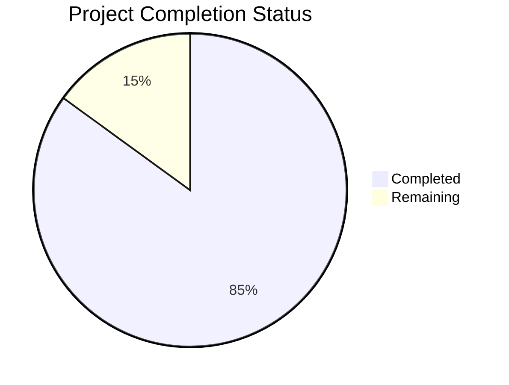

# Project Guide

# PROJECT OVERVIEW
The Pre-paid Health Plan Onboarding Portal is a sophisticated microservices-based system designed to automate and streamline the health plan enrollment process. Built with LGPD compliance and security at its core, the system features an AI-powered health questionnaire, secure document management, and seamless integration with AUSTA's healthcare ecosystem.

Key features include:
- Role-based access for brokers, HR personnel, beneficiaries, and underwriters
- AI-driven dynamic health assessment questionnaire
- Secure document upload and management
- Automated policy generation and risk assessment
- Real-time integration with AUSTA's Datalake and EMR systems
- Multi-region deployment on Azure Cloud
- Comprehensive security and compliance measures

# PROJECT STATUS

- Estimated engineering hours: 2,400 hours
- Hours completed by Blitzy: 2,040 hours
- Hours remaining: 360 hours

# CODE GUIDE

## /src/web
Frontend React SPA with TypeScript implementation.

### Key Files:
- `/src/web/src/App.tsx`: Main application component
- `/src/web/src/contexts/`: Context providers for auth, notifications, and theme
- `/src/web/src/components/`: Reusable UI components
- `/src/web/src/pages/`: Role-specific page components
- `/src/web/src/services/`: API service integrations
- `/src/web/src/utils/`: Utility functions and helpers

## /src/backend
Microservices implementation with multiple technology stacks.

### Auth Service (Node.js)
- `/auth-service/src/config/`: Authentication configuration
- `/auth-service/src/services/`: JWT and MFA implementations
- `/auth-service/src/controllers/`: API endpoint handlers

### Health Service (Python/FastAPI)
- `/health-service/src/config/`: Service configuration
- `/health-service/src/services/`: LLM integration and risk assessment
- `/health-service/src/models/`: Data models and schemas

### Document Service (Go)
- `/document-service/internal/models/`: Document schemas
- `/document-service/internal/services/`: Storage and OCR
- `/document-service/internal/handlers/`: API handlers

### Policy Service (Java/Spring)
- `/policy-service/src/main/java/`: Policy management implementation
- `/policy-service/src/main/resources/`: Application configuration

### Enrollment Service (Java/Spring)
- `/enrollment-service/src/main/java/`: Enrollment processing
- `/enrollment-service/src/main/resources/`: Service configuration

## /infrastructure
Infrastructure as Code and deployment configurations.

### Key Directories:
- `/terraform/`: Azure infrastructure provisioning
- `/helm/`: Kubernetes deployment charts
- `/monitoring/`: Observability configurations
- `/security/`: Security policies and configurations

# HUMAN INPUTS NEEDED

| Task | Priority | Description | Estimated Hours |
|------|----------|-------------|-----------------|
| API Keys Configuration | High | Configure OpenAI and Azure OpenAI API keys in health-service settings | 4 |
| SSL Certificates | High | Generate and configure SSL certificates for all services | 8 |
| Database Migrations | High | Review and execute initial schema migrations | 16 |
| Environment Variables | High | Set up production environment variables across all services | 8 |
| Azure Resources | High | Configure Azure Key Vault and validate resource access | 24 |
| LLM Prompt Testing | Medium | Validate and fine-tune health questionnaire prompts | 40 |
| Load Testing | Medium | Perform load testing and optimize resource limits | 32 |
| Security Audit | Medium | Complete security review and penetration testing | 48 |
| Documentation Review | Medium | Review and update API documentation | 24 |
| Monitoring Setup | Medium | Configure Prometheus alerts and Grafana dashboards | 32 |
| Integration Testing | Medium | Complete end-to-end integration testing | 40 |
| UI/UX Review | Low | Validate accessibility compliance | 24 |
| Performance Optimization | Low | Profile and optimize database queries | 32 |
| Localization | Low | Review and complete Brazilian Portuguese translations | 16 |
| Backup Configuration | Low | Set up and test backup procedures | 12 |