# Technical Specifications

# 1. INTRODUCTION

## 1.1 Executive Summary

The Pre-paid Health Plan Onboarding Portal is a comprehensive web-based system designed to automate and streamline the enrollment process for new health plan beneficiaries. The system addresses the critical challenges of manual onboarding, data security, and fragmented healthcare information by providing a secure, automated platform that integrates with AUSTA's broader healthcare ecosystem.

This solution enables brokers, HR personnel, and individual beneficiaries to efficiently process enrollments while maintaining strict separation of sensitive health information. The AI-powered health questionnaire, combined with secure document management and seamless integration with AUSTA's Datalake and EMR systems, delivers a unified approach to beneficiary onboarding and healthcare data management.

## 1.2 System Overview

### Project Context

| Aspect | Description |
|--------|-------------|
| Business Context | Modernization of pre-paid health plan enrollment process within AUSTA's digital transformation initiative |
| Current Limitations | Manual processes, security risks, fragmented data storage, delayed healthcare service delivery |
| Enterprise Integration | Part of AUSTA's integrated healthcare platform, connecting with Datalake, EMR, and SuperApp |

### High-Level Description

The system implements a containerized microservices architecture with:
- Role-based web portal for all stakeholders
- AI-powered dynamic health questionnaire
- Secure document and data storage
- Automated policy issuance
- Real-time integration with AUSTA's ecosystem

### Success Criteria

| Metric | Target |
|--------|---------|
| Processing Time | 90% of applications completed within 10 minutes (excluding questionnaire) |
| Data Accuracy | 99.9% accuracy in data capture and transfer |
| System Availability | 99.9% uptime excluding planned maintenance |
| Integration Performance | Real-time data sync with AUSTA systems |

## 1.3 Scope

### In-Scope Elements

| Category | Components |
|----------|------------|
| Core Features | - Role-based user management<br>- Dynamic health questionnaire<br>- Document management<br>- Policy issuance<br>- Payment processing |
| User Groups | - Brokers<br>- HR Personnel<br>- Individual Beneficiaries<br>- Parents/Guardians<br>- Underwriting Team<br>- Administrators |
| Integrations | - AUSTA Datalake<br>- AUSTA EMR<br>- AUSTA SuperApp<br>- Payment Gateways<br>- LLM Providers |
| Technical Requirements | - Brazilian Portuguese UI<br>- LGPD Compliance<br>- Multi-factor Authentication<br>- Containerized Architecture |

### Out-of-Scope Elements

- Legacy system data migration
- Direct integration with external healthcare providers
- Mobile native applications (mobile-responsive web only)
- Custom broker/corporate portals
- Real-time telemedicine integration
- Claims processing and management
- Provider network management
- Billing system integration beyond initial payment

# 2. SYSTEM ARCHITECTURE

## 2.1 High-Level Architecture

The Pre-paid Health Plan Onboarding Portal implements a microservices architecture deployed in containers, with clear separation of concerns and secure boundaries between components.

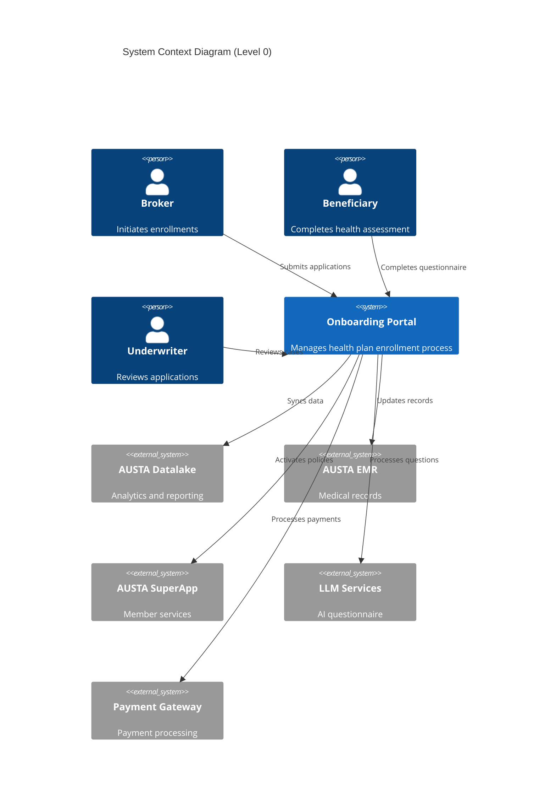

## 2.2 Container Architecture

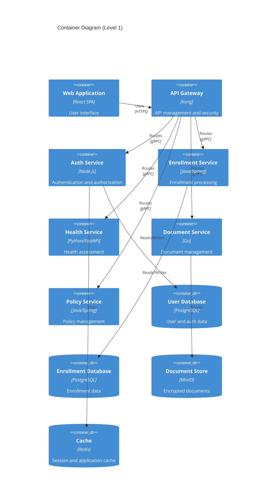

## 2.3 Component Details

### Core Services

| Service | Technology | Purpose | Scaling Strategy |
|---------|------------|---------|------------------|
| API Gateway | Kong | Route management, security | Horizontal per zone |
| Auth Service | Node.js | User management, JWT | Horizontal with sticky sessions |
| Enrollment Service | Java/Spring | Application processing | Horizontal stateless |
| Health Service | Python/FastAPI | Questionnaire management | Horizontal stateless |
| Document Service | Go | Document handling | Horizontal with sharding |
| Policy Service | Java/Spring | Policy management | Horizontal stateless |

### Data Stores

| Store | Technology | Purpose | Backup Strategy |
|-------|------------|---------|-----------------|
| User DB | PostgreSQL | Authentication data | Active-passive with streaming |
| Enrollment DB | PostgreSQL | Application data | Active-passive with streaming |
| Document Store | MinIO | Encrypted files | Cross-region replication |
| Cache | Redis | Session management | Master-replica clusters |

## 2.4 Data Flow Architecture

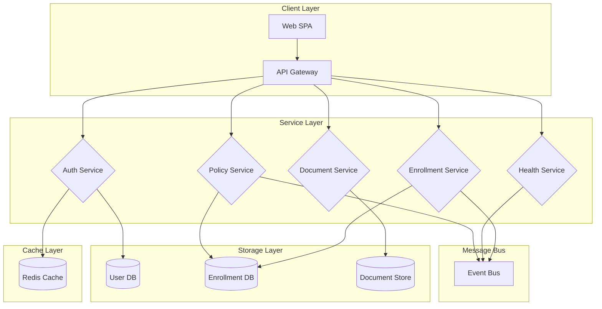

## 2.5 Deployment Architecture

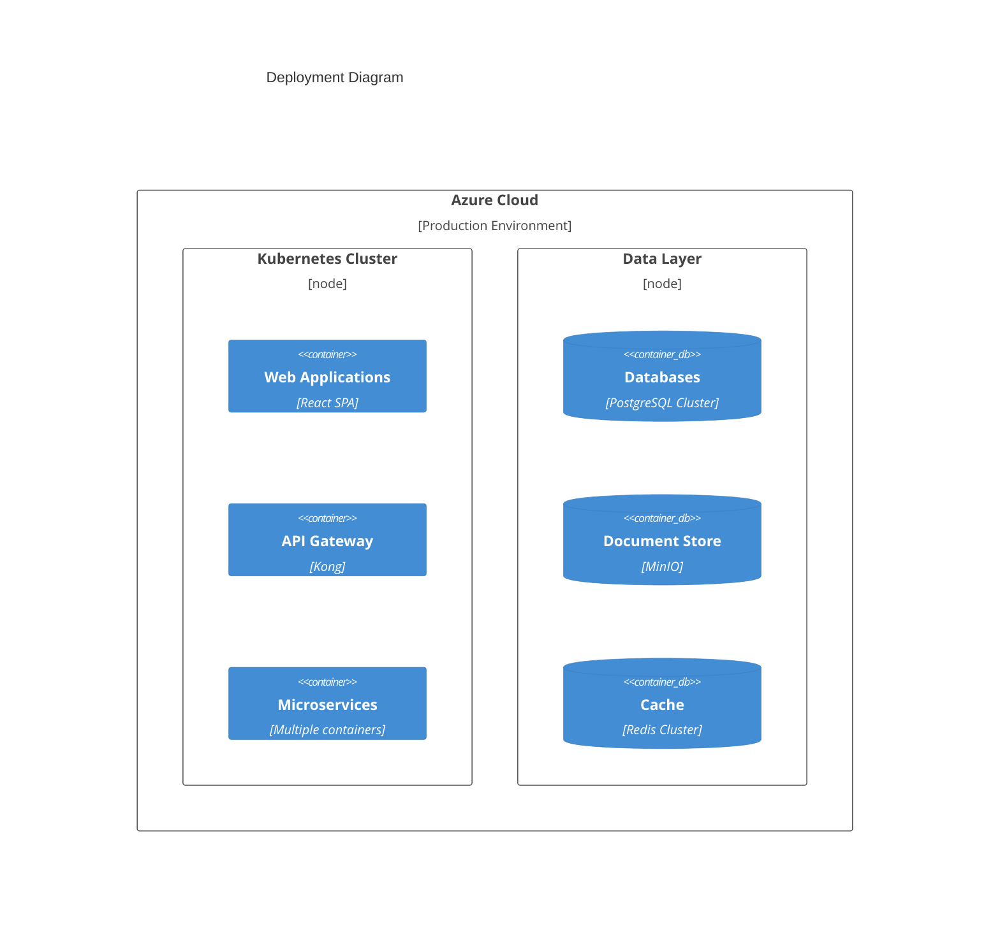

## 2.6 Technical Decisions

### Architecture Choices

| Decision | Rationale |
|----------|-----------|
| Microservices | Enables independent scaling and deployment of components |
| Event-Driven | Facilitates asynchronous processing and loose coupling |
| Container-Based | Ensures consistency across environments and easy scaling |
| Multi-Region | Provides high availability and disaster recovery |

### Communication Patterns

| Pattern | Usage |
|---------|--------|
| gRPC | Internal service communication |
| REST | External API interfaces |
| Event Bus | Asynchronous operations |
| WebSocket | Real-time updates |

## 2.7 Cross-Cutting Concerns

### Monitoring & Observability

- Distributed tracing with Jaeger
- Metrics collection with Prometheus
- Centralized logging with ELK Stack
- Application performance monitoring with New Relic

### Security Implementation

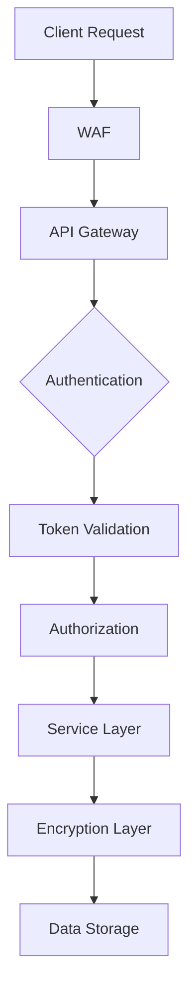

### Error Handling Strategy

- Circuit breakers for external services
- Retry policies with exponential backoff
- Dead letter queues for failed events
- Graceful degradation of services

### Performance Requirements

| Component | Target |
|-----------|--------|
| API Response | 95% < 200ms |
| Document Upload | < 3 seconds |
| Health Assessment | < 500ms per question |
| Policy Generation | < 5 seconds |

# 3. SYSTEM COMPONENTS ARCHITECTURE

## 3.1 User Interface Design

### 3.1.1 Design System Specifications

| Component | Specification | Details |
|-----------|--------------|---------|
| Typography | Roboto Family | Primary: Regular 400, Bold 700<br>Headers: Medium 500<br>Minimum size: 14px |
| Color Scheme | AUSTA Brand | Primary: #0047AB<br>Secondary: #00A86B<br>Error: #DC3545<br>Warning: #FFC107 |
| Grid System | 12-column | Breakpoints: 320px, 768px, 1024px, 1440px |
| Spacing | 8px base unit | Margins/Padding: 8px, 16px, 24px, 32px, 48px |
| Accessibility | WCAG 2.1 AA | Contrast ratio ≥ 4.5:1<br>Focus indicators<br>ARIA labels |

### 3.1.2 Role-Based Interface Components

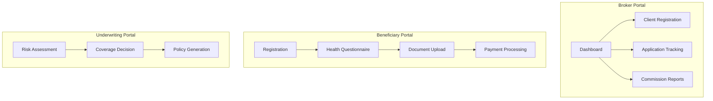

### 3.1.3 Critical User Flows

| Flow | Components | Validation Rules |
|------|------------|-----------------|
| Enrollment | - Personal Info Form<br>- Address Verification<br>- Document Upload | - Required fields<br>- CPF validation<br>- Age verification |
| Health Assessment | - Dynamic Questionnaire<br>- Medical History<br>- Risk Factors | - Conditional questions<br>- Consistency checks<br>- Document requirements |
| Payment Processing | - Plan Selection<br>- Payment Method<br>- Confirmation | - Amount validation<br>- Payment gateway rules<br>- Receipt generation |

## 3.2 Database Design

### 3.2.1 Data Models

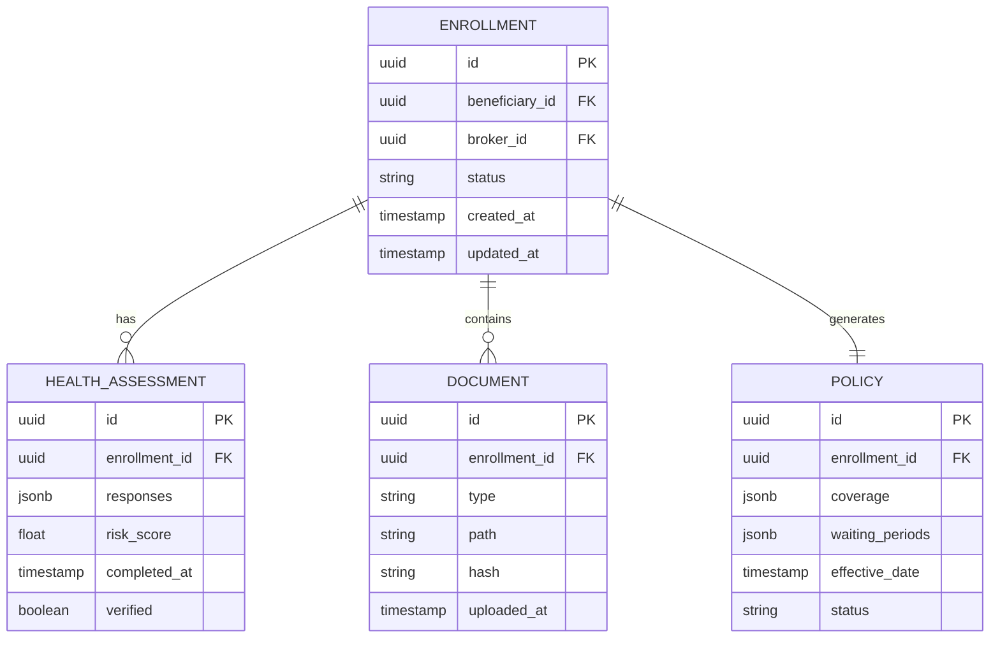

### 3.2.2 Storage Strategy

| Data Type | Storage Solution | Encryption | Backup Frequency |
|-----------|-----------------|------------|------------------|
| Enrollment Data | PostgreSQL | Column-level AES-256 | Real-time streaming |
| Documents | MinIO | Object-level encryption | Daily snapshots |
| Health Data | PostgreSQL | Field-level encryption | Real-time streaming |
| Audit Logs | TimescaleDB | Row-level encryption | Hourly incremental |

### 3.2.3 Performance Optimization

| Aspect | Implementation | Details |
|--------|----------------|---------|
| Indexing | - B-tree indexes for lookups<br>- GiST indexes for complex data | - Enrollment status<br>- Beneficiary ID<br>- Document types |
| Partitioning | - Range partitioning by date<br>- List partitioning by status | - Monthly enrollment partitions<br>- Active/archived policies |
| Caching | - Redis for session data<br>- PostgreSQL materialized views | - 15-minute refresh interval<br>- Query-specific caching |

## 3.3 API Design

### 3.3.1 API Architecture

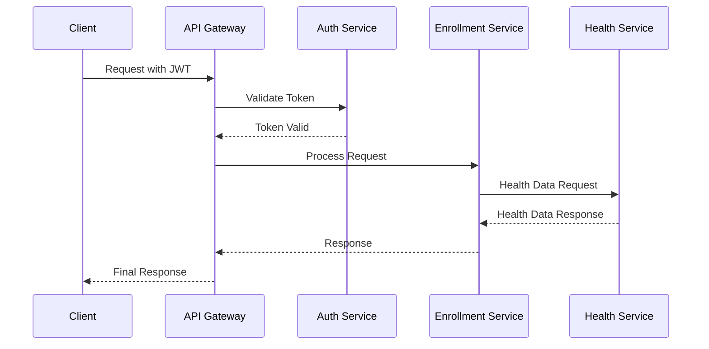

### 3.3.2 API Endpoints

| Endpoint | Method | Purpose | Authentication |
|----------|--------|---------|----------------|
| /api/v1/enrollments | POST | Create enrollment | JWT + Broker Role |
| /api/v1/health-assessment | POST | Submit questionnaire | JWT + Beneficiary Role |
| /api/v1/documents | POST | Upload documents | JWT + Multi-part |
| /api/v1/policies | GET | Retrieve policies | JWT + Role-based |

### 3.3.3 Integration Patterns

| Pattern | Implementation | Purpose |
|---------|----------------|---------|
| Circuit Breaker | Hystrix | Service failure isolation |
| Rate Limiting | Kong | API abuse prevention |
| Request Tracing | Jaeger | Distributed tracing |
| Message Queue | RabbitMQ | Async processing |
| Service Discovery | Consul | Dynamic service routing |

### 3.3.4 Security Controls

| Control | Implementation | Details |
|---------|----------------|---------|
| Authentication | OAuth 2.0 + JWT | - Token expiration: 1 hour<br>- Refresh token: 24 hours |
| Authorization | RBAC | - Role-based permissions<br>- Resource-level access |
| API Security | - Rate limiting<br>- Input validation<br>- Response sanitization | - 1000 requests/hour<br>- JSON Schema validation<br>- Data masking |
| Encryption | - TLS 1.3<br>- Field-level encryption | - Perfect forward secrecy<br>- Sensitive data encryption |

# 4. TECHNOLOGY STACK

## 4.1 PROGRAMMING LANGUAGES

| Platform/Component | Language | Version | Justification |
|-------------------|----------|---------|---------------|
| Frontend SPA | TypeScript | 5.0+ | Type safety, enhanced IDE support, better maintainability |
| API Gateway | Go | 1.21+ | High performance, excellent concurrency for API routing |
| Auth Service | Node.js | 20 LTS | Async I/O efficiency, extensive auth library ecosystem |
| Enrollment Service | Java | 17 LTS | Enterprise-grade stability, Spring ecosystem compatibility |
| Health Service | Python | 3.11+ | Rich ML/AI libraries, excellent LLM integration support |
| Document Service | Go | 1.21+ | Efficient binary handling, strong performance for file operations |
| Policy Service | Java | 17 LTS | Strong typing, enterprise integration capabilities |

## 4.2 FRAMEWORKS & LIBRARIES

### Frontend Framework
- React 18.0+
  - Redux Toolkit for state management
  - React Query for API data fetching
  - React Hook Form for form handling
  - Material-UI v5 for UI components
- Justification: Robust ecosystem, excellent TypeScript support, AUSTA expertise

### Backend Frameworks
- Spring Boot 3.0+ (Java Services)
  - Spring Security for authentication
  - Spring Cloud for microservices
  - Spring Data JPA for ORM
- FastAPI 0.100+ (Python Health Service)
  - Pydantic for data validation
  - LangChain for LLM integration
- Gin 1.9+ (Go Services)
  - Go-JWT for token handling
  - GORM for database operations

## 4.3 DATABASES & STORAGE

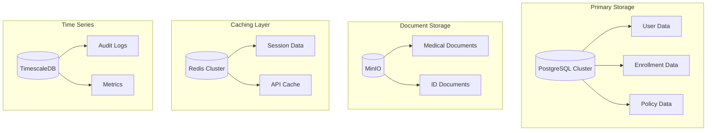

### Storage Solutions

| Type | Technology | Version | Purpose |
|------|------------|---------|----------|
| Primary Database | PostgreSQL | 15+ | Transactional data, ACID compliance |
| Document Store | MinIO | RELEASE.2023-09-23T03-47-50Z | S3-compatible object storage |
| Cache | Redis | 7.0+ | Session management, API caching |
| Time Series | TimescaleDB | 2.11+ | Metrics, audit logs |
| Search | Elasticsearch | 8.10+ | Full-text search capabilities |

## 4.4 THIRD-PARTY SERVICES

| Service Type | Provider | Purpose | Integration Method |
|-------------|----------|---------|-------------------|
| LLM Services | OpenAI, Azure OpenAI | Health questionnaire AI | REST API |
| Payment Gateway | PagSeguro, Stripe | Payment processing | REST API |
| Email Service | AWS SES | Notifications | SMTP/API |
| SMS Gateway | Twilio | MFA, notifications | REST API |
| OCR Service | Azure Computer Vision | Document processing | REST API |
| Monitoring | Datadog | Application monitoring | Agent-based |
| APM | New Relic | Performance monitoring | Agent-based |

## 4.5 DEVELOPMENT & DEPLOYMENT

### Development Tools
- IDE: JetBrains Suite (IntelliJ, PyCharm, GoLand)
- API Testing: Postman
- Version Control: Git with GitHub
- Documentation: Confluence
- Issue Tracking: Jira

### Build & Deployment Pipeline

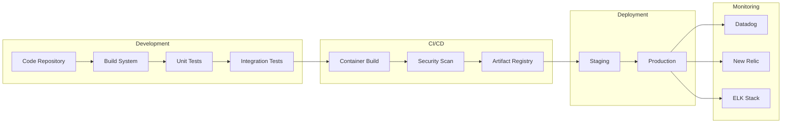

### Infrastructure Components

| Component | Technology | Version | Purpose |
|-----------|------------|---------|----------|
| Container Runtime | Docker | 24.0+ | Application containerization |
| Orchestration | Kubernetes | 1.27+ | Container orchestration |
| Service Mesh | Istio | 1.19+ | Microservices networking |
| Load Balancer | NGINX | 1.25+ | Traffic distribution |
| CI/CD | Azure DevOps | Latest | Deployment automation |
| IaC | Terraform | 1.5+ | Infrastructure provisioning |

### Security Tools
- SonarQube for code quality
- Snyk for dependency scanning
- Aqua Security for container scanning
- HashiCorp Vault for secrets management
- Azure Key Vault for certificate management

# 5. SYSTEM DESIGN

## 5.1 User Interface Design

### 5.1.1 Layout Structure

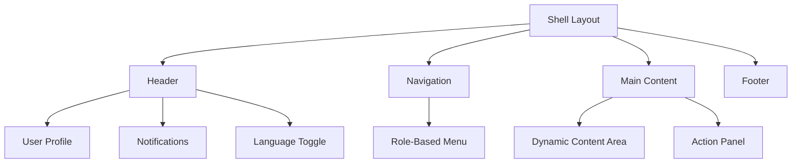

### 5.1.2 Key Interface Components

| Component | Purpose | Key Features |
|-----------|----------|-------------|
| Header Bar | Navigation and user context | - User profile menu<br>- Notifications center<br>- Language selector<br>- Help access |
| Side Navigation | Role-based menu access | - Collapsible menu<br>- Icon + text labels<br>- Active state indicators |
| Content Area | Primary workspace | - Responsive grid layout<br>- Card-based components<br>- Loading states |
| Action Panel | Context-sensitive actions | - Primary/Secondary actions<br>- Status indicators<br>- Quick filters |

### 5.1.3 Health Questionnaire Flow

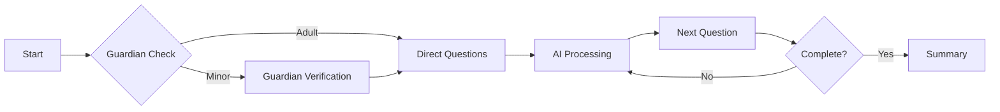

## 5.2 Database Design

### 5.2.1 Core Schema

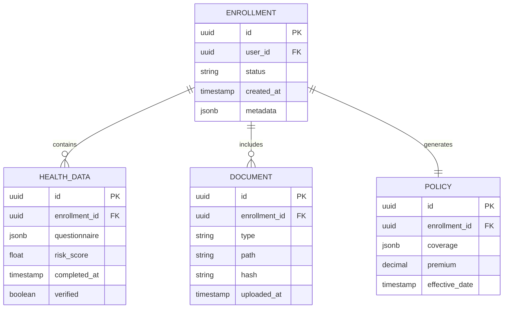

### 5.2.2 Data Partitioning Strategy

| Partition Type | Implementation | Purpose |
|----------------|----------------|----------|
| Time-based | Monthly enrollment partitions | Historical data management |
| Status-based | Active/Archived policies | Query optimization |
| Region-based | Geographic sharding | Data locality compliance |

## 5.3 API Design

### 5.3.1 REST Endpoints

| Endpoint | Method | Purpose | Request Body | Response |
|----------|--------|---------|--------------|-----------|
| /api/v1/enrollments | POST | Create enrollment | Enrollment details | Enrollment ID |
| /api/v1/health-assessment/{id} | POST | Submit questionnaire | Health data | Assessment result |
| /api/v1/documents/{enrollment_id} | POST | Upload document | Multipart form | Document metadata |
| /api/v1/policies/{enrollment_id} | GET | Retrieve policy | - | Policy details |

### 5.3.2 Integration Flow

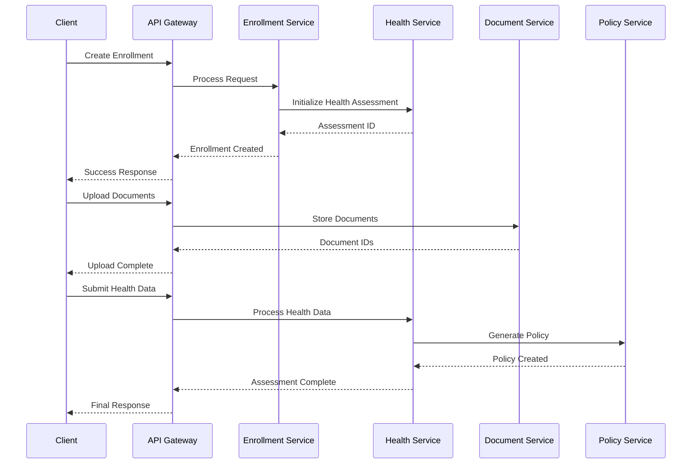

### 5.3.3 Error Handling

| Error Category | HTTP Status | Response Format | Example |
|----------------|-------------|-----------------|---------|
| Validation | 400 | {error: string, fields: object} | Invalid data format |
| Authentication | 401 | {error: string, code: string} | Token expired |
| Authorization | 403 | {error: string, required: string} | Insufficient permissions |
| Resource | 404 | {error: string, resource: string} | Enrollment not found |
| System | 500 | {error: string, trace_id: string} | Internal error |

### 5.3.4 Rate Limiting

| Endpoint Category | Rate Limit | Window | Burst |
|-------------------|------------|--------|--------|
| Public APIs | 1000 | 1 hour | 50 |
| Health Assessment | 100 | 1 hour | 10 |
| Document Upload | 50 | 1 hour | 5 |
| Admin APIs | 5000 | 1 hour | 100 |

# 6. USER INTERFACE DESIGN

## 6.1 Design System

### 6.1.1 Common Components

```
Key:
[?] - Help/Info tooltip
[$] - Payment/Financial
[i] - Information
[+] - Add/Create
[x] - Close/Delete
[<] [>] - Navigation
[^] - Upload
[#] - Menu/Dashboard
[@] - User/Profile
[!] - Alerts/Warnings
[=] - Settings
[*] - Important/Required
```

### 6.1.2 Base Layout Structure

```
+----------------------------------------------------------+
|                      AUSTA Health Portal                [@]|
+--[#]---------------------------------------------------+-+
|                                                         |
|  +--Navigation--+  +--Main Content-------------------+  |
|  | [#] Dashboard|  |                                 |  |
|  | [+] New      |  |                                 |  |
|  | [@] Profile  |  |                                 |  |
|  | [=] Settings |  |                                 |  |
|  | [?] Help     |  |                                 |  |
|  +-------------+   |                                 |  |
|                    |                                 |  |
|                    |                                 |  |
|                    |                                 |  |
|                    +---------------------------------+  |
+----------------------------------------------------------+
```

## 6.2 Role-Specific Interfaces

### 6.2.1 Broker Dashboard

```
+----------------------------------------------------------+
|                      AUSTA Health Portal             [@]   |
+--[#]---------------------------------------------------+-+
|  +--Quick Actions--+  +--Active Enrollments------------+  |
|  | [+] New Client  |  | Search: [..................]   |  |
|  | [$] Commission  |  | Status: [v] All               |  |
|  | [#] Reports     |  +------------------------------+   |
|  +----------------+   | Name         Status    Action |   |
|                      | João Silva   Pending   [View]  |   |
|  +--Statistics----+  | Maria Santos Complete  [View]  |   |
|  | Pending: 12    |  | Pedro Lima   Review    [View]  |   |
|  | Complete: 45   |  +------------------------------+   |
|  | This Month: 57 |                                     |
|  +----------------+                                      |
+----------------------------------------------------------+
```

### 6.2.2 Health Questionnaire

```
+----------------------------------------------------------+
|                Health Assessment              [Step 2 of 5] |
+----------------------------------------------------------+
|                                                           |
|  Question: Do you have any pre-existing conditions? [?]   |
|                                                           |
|  ( ) No, I don't have any pre-existing conditions        |
|  ( ) Yes, I have one or more conditions                  |
|                                                          |
|  [If yes, please specify:]                               |
|  +------------------------------------------------+     |
|  |                                                |     |
|  | [..........................................]   |     |
|  |                                                |     |
|  +------------------------------------------------+     |
|                                                          |
|  [!] All information is protected by LGPD               |
|                                                          |
|  [< Back]                          [Continue >]          |
+----------------------------------------------------------+
```

### 6.2.3 Document Upload Interface

```
+----------------------------------------------------------+
|                Document Upload                             |
+----------------------------------------------------------+
|                                                           |
|  Required Documents:                                      |
|  [*] ID Document (RG/CPF)                                |
|  [*] Proof of Address                                    |
|  [ ] Medical Records (if applicable)                     |
|                                                          |
|  +--Upload Area-----------------------------------+      |
|  |                                                |      |
|  |    [^] Drag and drop files here               |      |
|  |        or click to select files               |      |
|  |                                                |      |
|  +------------------------------------------------+      |
|                                                          |
|  Uploaded Files:                                         |
|  +--------------------------------------------------+   |
|  | cpf.pdf           [x] Remove  [i] Verified       |   |
|  | address.jpg       [x] Remove  [!] Processing     |   |
|  +--------------------------------------------------+   |
|                                                          |
|  [< Back]                          [Continue >]          |
+----------------------------------------------------------+
```

### 6.2.4 Underwriting Review Interface

```
+----------------------------------------------------------+
|                Risk Assessment Review                      |
+----------------------------------------------------------+
|  Beneficiary: João Silva                    Risk: HIGH    |
|  +--Health Data------------------------+  +-Actions-----+  |
|  | Pre-existing: Diabetes Type 2      |  | [Approve]   |  |
|  | Medications: Metformin             |  | [Modify]    |  |
|  | Risk Factors: 3 identified         |  | [Reject]    |  |
|  +----------------------------------+  +-----------+    |
|                                                         |
|  +--Coverage Adjustments-------------------------+      |
|  | [v] Extended waiting period - Cardiology      |      |
|  | [v] Coverage limitation - Endocrinology       |      |
|  | [ ] Additional premium loading                |      |
|  +---------------------------------------------+       |
|                                                        |
|  Notes: [......................................]        |
|                                                        |
|  [Save Draft]                    [Submit Decision]     |
+----------------------------------------------------------+
```

### 6.2.5 Payment Processing Interface

```
+----------------------------------------------------------+
|                Payment Selection                    [$]    |
+----------------------------------------------------------+
|                                                           |
|  Plan: Premium Health              Monthly Fee: R$ 450,00 |
|                                                          |
|  Select Payment Method:                                  |
|  ( ) PIX                                                |
|  ( ) Credit Card                                        |
|  ( ) Boleto                                            |
|                                                          |
|  +--Payment Details--------------------------------+     |
|  |                                                |     |
|  | First Payment: R$ 450,00                       |     |
|  | Processing Fee: R$ 0,00                        |     |
|  | Total: R$ 450,00                              |     |
|  |                                                |     |
|  +------------------------------------------------+     |
|                                                          |
|  [!] Recurring payments will be processed monthly        |
|                                                          |
|  [< Back]                     [Proceed to Payment >]     |
+----------------------------------------------------------+
```

## 6.3 Responsive Design Breakpoints

| Breakpoint | Width | Layout Adjustments |
|------------|-------|-------------------|
| Mobile | 320px - 767px | Single column, stacked navigation |
| Tablet | 768px - 1023px | Two column, collapsible navigation |
| Desktop | 1024px+ | Full layout with sidebars |

## 6.4 Accessibility Features

- High contrast mode support
- Keyboard navigation
- ARIA labels on all interactive elements
- Screen reader compatibility
- Minimum touch target size 44x44px
- Focus indicators on all interactive elements

## 6.5 Error States

```
+----------------------------------------------------------+
|                      Error Display                   [!]   |
+----------------------------------------------------------+
|                                                           |
|  [!] Error: Unable to process request                     |
|                                                           |
|  Details: The health questionnaire is incomplete.         |
|  Please ensure all required fields (*) are filled.        |
|                                                           |
|  Error Code: ERR_INCOMPLETE_FORM                          |
|                                                           |
|  [Try Again]                    [Save Draft]              |
+----------------------------------------------------------+
```

# 7. SECURITY CONSIDERATIONS

## 7.1 Authentication and Authorization

### 7.1.1 Authentication Methods

| User Type | Primary Authentication | Secondary Authentication | Session Duration |
|-----------|----------------------|------------------------|------------------|
| Brokers | Email/Password | SMS OTP | 8 hours |
| HR Personnel | Email/Password | SMS OTP | 8 hours |
| Beneficiaries | Email/Password | N/A | 30 minutes |
| Parents/Guardians | Email/Password | Document Verification | 30 minutes |
| Underwriting Team | Email/Password | Hardware Token (TOTP) | 4 hours |
| Administrators | Email/Password | Hardware Token (TOTP) | 4 hours |

### 7.1.2 Authorization Matrix

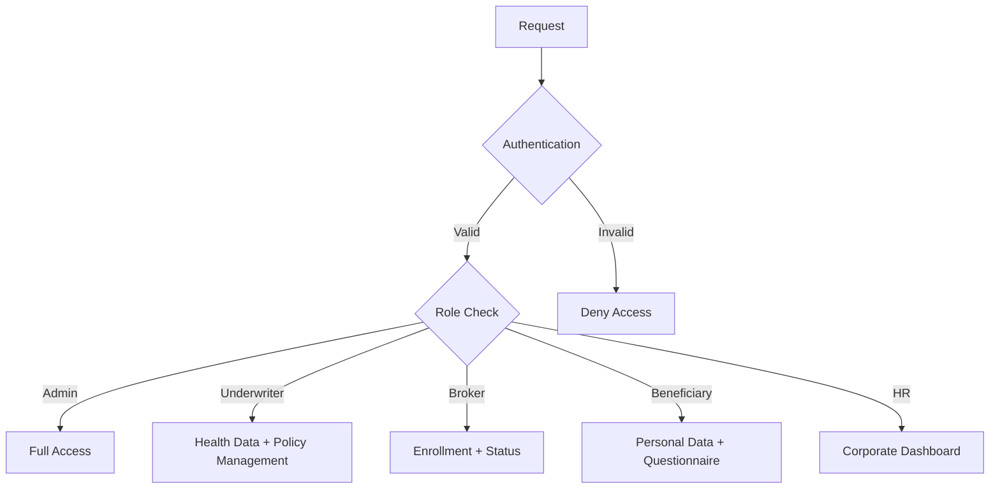

### 7.1.3 Role-Based Access Control

| Role | Enrollment Data | Health Data | Documents | Policy Data | System Config |
|------|----------------|-------------|-----------|-------------|---------------|
| Administrator | Full Access | Full Access | Full Access | Full Access | Full Access |
| Underwriter | Read | Full Access | Read | Full Access | No Access |
| Broker | Create/Read | No Access | Upload/Read | Read | No Access |
| HR Personnel | Create/Read | No Access | Upload/Read | Read | No Access |
| Beneficiary | Read Own | Own Only | Own Only | Read Own | No Access |
| Parent/Guardian | Read Minor's | Minor's Only | Minor's Only | Read Minor's | No Access |

## 7.2 Data Security

### 7.2.1 Encryption Standards

| Data Type | At Rest | In Transit | Key Management |
|-----------|----------|------------|----------------|
| Personal Information | AES-256 | TLS 1.3 | AWS KMS |
| Health Data | AES-256 GCM | TLS 1.3 | AWS KMS |
| Documents | AES-256 | TLS 1.3 | AWS KMS |
| Authentication Tokens | SHA-256 HMAC | TLS 1.3 | Redis Cluster |
| Payment Information | AES-256 | TLS 1.3 | PCI DSS Compliant |

### 7.2.2 Data Protection Flow

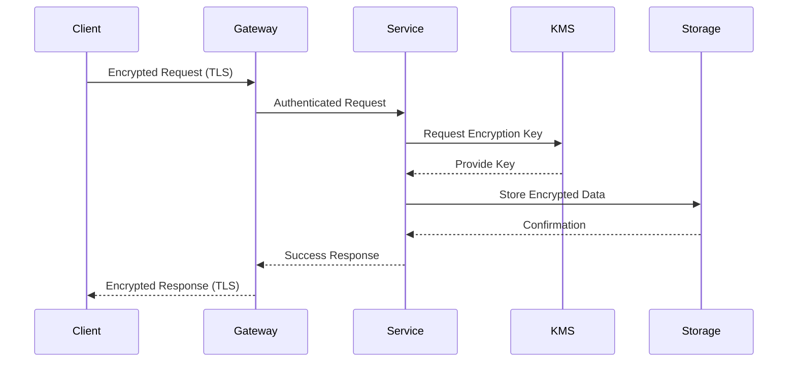

### 7.2.3 Data Masking Rules

| Data Type | Masking Pattern | Example |
|-----------|----------------|---------|
| CPF | XXX.XXX.XXX-XX | ***.***.***-12 |
| Email | X{3}@domain | joh*****@domain.com |
| Phone | +XX (XX) XXXXX-XXXX | +55 (11) *****-1234 |
| Credit Card | XXXX-XXXX-XXXX-XXXX | ****-****-****-4321 |
| Health Data | Full Encryption | [Encrypted] |

## 7.3 Security Protocols

### 7.3.1 Access Control Implementation

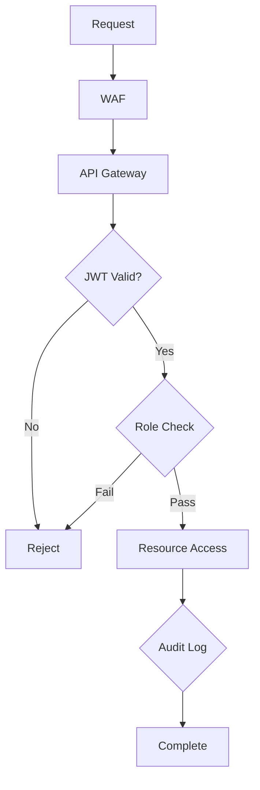

### 7.3.2 Security Monitoring

| Component | Monitoring Type | Alert Threshold | Response Time |
|-----------|----------------|-----------------|---------------|
| WAF | Real-time threat detection | Any blocked request | Immediate |
| API Gateway | Rate limiting | >1000 req/min | 1 minute |
| Authentication Service | Failed attempts | >5 in 5 minutes | 5 minutes |
| Data Access | Suspicious patterns | Unusual access patterns | 15 minutes |
| Encryption Services | Key usage | Unauthorized attempts | Immediate |

### 7.3.3 Security Compliance Requirements

| Requirement | Implementation | Validation |
|-------------|----------------|------------|
| LGPD Compliance | Data encryption, access controls | Quarterly audit |
| Healthcare Data Protection | Isolated storage, encryption | Monthly review |
| Access Logging | Comprehensive audit trails | Daily monitoring |
| Incident Response | Automated detection and response | 24/7 monitoring |
| Penetration Testing | External security assessment | Quarterly |
| Vulnerability Scanning | Automated security scanning | Weekly |

### 7.3.4 Security Update Process

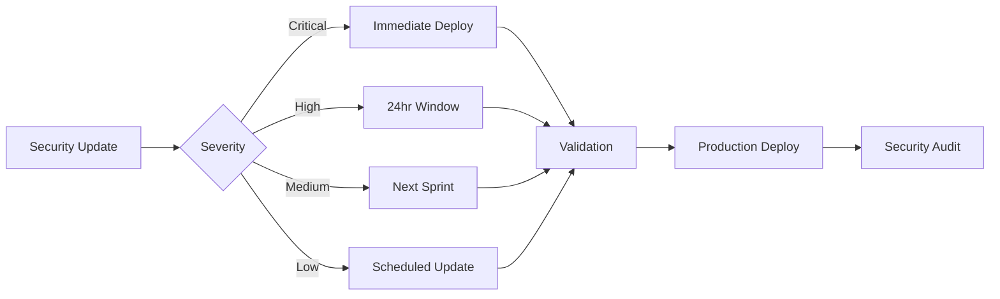

# 8. INFRASTRUCTURE

## 8.1 DEPLOYMENT ENVIRONMENT

The Pre-paid Health Plan Onboarding Portal utilizes a cloud-native architecture deployed on Azure Cloud, with multi-region deployment for high availability and disaster recovery.

| Environment | Purpose | Configuration |
|------------|---------|---------------|
| Development | Feature development and testing | Single region, scaled-down resources |
| Staging | Pre-production testing and integration | Multi-region, production-like setup |
| Production | Live system operation | Multi-region, full HA configuration |
| DR | Disaster recovery | Secondary region, hot standby |

### Regional Distribution

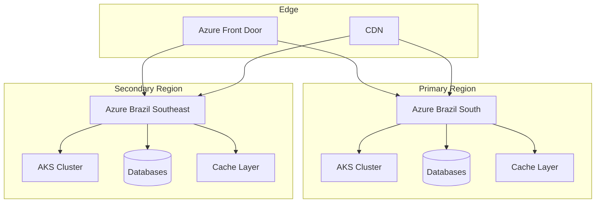

## 8.2 CLOUD SERVICES

| Service | Purpose | Configuration |
|---------|---------|---------------|
| Azure Kubernetes Service (AKS) | Container orchestration | Production: 3 node pools<br>Min nodes: 3<br>Max nodes: 12 |
| Azure Database for PostgreSQL | Primary data storage | Hyperscale (Citus)<br>Multi-region failover |
| Azure Cache for Redis | Session and cache management | Premium tier<br>Zone redundant |
| Azure Key Vault | Secrets and certificate management | Premium tier<br>RBAC enabled |
| Azure Front Door | Global load balancing and WAF | Premium tier<br>Custom rules |
| Azure Monitor | System monitoring and alerting | Application Insights integration |
| Azure Storage | Document and backup storage | RA-GRS replication |
| Azure Container Registry | Container image registry | Premium tier<br>Geo-replication |

## 8.3 CONTAINERIZATION

### Container Strategy

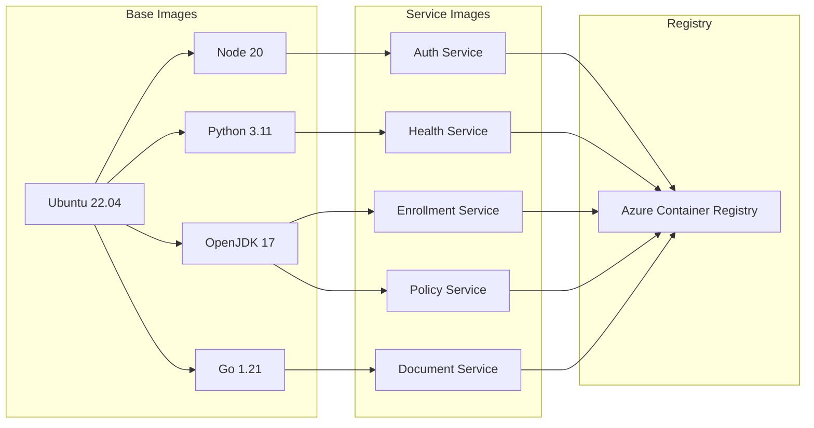

### Container Specifications

| Service | Base Image | Resource Limits |
|---------|------------|-----------------|
| Auth Service | node:20-alpine | CPU: 1 core<br>Memory: 2Gi |
| Health Service | python:3.11-slim | CPU: 2 cores<br>Memory: 4Gi |
| Enrollment Service | eclipse-temurin:17-jre | CPU: 2 cores<br>Memory: 4Gi |
| Policy Service | eclipse-temurin:17-jre | CPU: 2 cores<br>Memory: 4Gi |
| Document Service | golang:1.21-alpine | CPU: 1 core<br>Memory: 2Gi |

## 8.4 ORCHESTRATION

### Kubernetes Architecture

```mermaid
flowchart TD
    subgraph AKS Cluster
        A[Ingress Controller] --> B[API Gateway]
        
        subgraph Service Mesh
            B --> C[Auth]
            B --> D[Health]
            B --> E[Enrollment]
            B --> F[Policy]
            B --> G[Document]
        end
        
        subgraph Storage
            H[(PostgreSQL)]
            I[(Redis)]
            J[(MinIO)]
        end
        
        C --> H
        C --> I
        D --> H
        E --> H
        F --> H
        G --> J
    end
```

### Kubernetes Components

| Component | Configuration | Purpose |
|-----------|--------------|----------|
| Ingress-NGINX | DaemonSet | Load balancing and SSL termination |
| Istio | Service Mesh | Traffic management and security |
| Cert-Manager | ClusterIP | Certificate automation |
| Prometheus | StatefulSet | Metrics collection |
| Grafana | Deployment | Metrics visualization |
| Jaeger | DaemonSet | Distributed tracing |

## 8.5 CI/CD PIPELINE

### Pipeline Architecture

```mermaid
flowchart LR
    subgraph Source
        A[GitHub] --> B[Azure DevOps]
    end
    
    subgraph Build
        B --> C[Code Analysis]
        C --> D[Unit Tests]
        D --> E[Container Build]
        E --> F[Security Scan]
    end
    
    subgraph Deploy
        F --> G[Dev Deploy]
        G --> H[Integration Tests]
        H --> I[Staging Deploy]
        I --> J[E2E Tests]
        J --> K[Production Deploy]
    end
    
    subgraph Monitor
        K --> L[Health Checks]
        L --> M[Performance Metrics]
        M --> N[Alert System]
    end
```

### Pipeline Stages

| Stage | Tools | SLO |
|-------|-------|-----|
| Code Analysis | SonarQube | Coverage > 80% |
| Security Scan | Snyk, Aqua | Zero high vulnerabilities |
| Unit Tests | Jest, JUnit, PyTest | 100% pass rate |
| Integration Tests | Postman, Newman | 100% pass rate |
| E2E Tests | Cypress | 100% pass rate |
| Deployment | Helm, Terraform | < 15 minutes |
| Validation | Azure Monitor | All health checks passing |

### Deployment Strategy

| Environment | Strategy | Rollback Time |
|-------------|----------|---------------|
| Development | Direct deployment | Immediate |
| Staging | Blue/Green | < 5 minutes |
| Production | Canary (10% → 50% → 100%) | < 2 minutes |
| DR | Active-Active failover | < 1 minute |

# 9. APPENDICES

## 9.1 Additional Technical Information

### 9.1.1 Health Questionnaire AI Flow

```mermaid
flowchart TD
    A[Start] --> B[Load Question Bank]
    B --> C[Initialize LLM Context]
    C --> D[Present Initial Question]
    D --> E{Process Response}
    E --> F[Analyze Risk Factors]
    F --> G{Risk Level}
    G -->|High| H[Deep Dive Questions]
    G -->|Low| I[Standard Questions]
    H --> J[Document Request]
    I --> K[Complete Assessment]
    J --> K
    K --> L[Generate Risk Score]
```

### 9.1.2 Document Processing Pipeline

| Stage | Process | Technology | SLA |
|-------|---------|------------|-----|
| Upload | Multi-part file upload | MinIO | < 3s |
| Validation | File integrity & virus scan | ClamAV | < 5s |
| OCR | Text extraction | Azure Computer Vision | < 10s |
| Classification | Document type detection | Custom ML Model | < 2s |
| Data Extraction | Information parsing | Azure Form Recognizer | < 8s |
| Storage | Encrypted object storage | MinIO + AES-256 | < 1s |

### 9.1.3 Integration Error Handling

```mermaid
flowchart LR
    A[API Call] --> B{Success?}
    B -->|Yes| C[Process Response]
    B -->|No| D{Error Type}
    D -->|Timeout| E[Retry with Backoff]
    D -->|Validation| F[Log and Alert]
    D -->|System| G[Circuit Breaker]
    E --> H[Dead Letter Queue]
    F --> I[Error Response]
    G --> J[Fallback Process]
```

## 9.2 GLOSSARY

| Term | Definition |
|------|------------|
| Aggravation | Additional coverage restrictions based on health assessment |
| Beneficiary | Individual enrolled in the health plan |
| Carência | Mandatory waiting period for specific medical procedures |
| Corretor | Licensed insurance broker |
| Dead Letter Queue | Storage for failed message processing |
| Hot Standby | Secondary system ready for immediate takeover |
| Triagem | Initial health screening process |
| Circuit Breaker | Pattern to prevent cascade failures |
| Idempotency | Property ensuring same operation produces same result |
| Sharding | Database partitioning for performance |

## 9.3 ACRONYMS

| Acronym | Full Form |
|---------|-----------|
| AES | Advanced Encryption Standard |
| AKS | Azure Kubernetes Service |
| API | Application Programming Interface |
| CORS | Cross-Origin Resource Sharing |
| DLQ | Dead Letter Queue |
| EMR | Electronic Medical Record |
| FHIR | Fast Healthcare Interoperability Resources |
| GDPR | General Data Protection Regulation |
| HA | High Availability |
| HIPAA | Health Insurance Portability and Accountability Act |
| JWT | JSON Web Token |
| LGPD | Lei Geral de Proteção de Dados |
| LLM | Large Language Model |
| MFA | Multi-Factor Authentication |
| MTBF | Mean Time Between Failures |
| MTTR | Mean Time To Recovery |
| OCR | Optical Character Recognition |
| RBAC | Role-Based Access Control |
| RTO | Recovery Time Objective |
| RPO | Recovery Point Objective |
| SLA | Service Level Agreement |
| SPA | Single Page Application |
| SSL | Secure Sockets Layer |
| TLS | Transport Layer Security |
| WAF | Web Application Firewall |
| XSS | Cross-Site Scripting |

## 9.4 Development Environment Setup

### 9.4.1 Local Development Stack

```mermaid
flowchart TD
    subgraph Development Environment
        A[VS Code/JetBrains IDE] --> B[Docker Desktop]
        B --> C[Local K8s Cluster]
        C --> D[Microservices]
        C --> E[Databases]
        C --> F[Cache]
    end
    
    subgraph Testing Tools
        G[Jest] --> H[Testing DB]
        I[Postman] --> J[Mock Services]
        K[Cypress] --> L[E2E Tests]
    end
    
    subgraph Version Control
        M[Git] --> N[GitHub]
        N --> O[Actions]
    end
```

### 9.4.2 Required Developer Tools

| Category | Tools | Version |
|----------|-------|---------|
| IDE | VS Code or JetBrains Suite | Latest |
| Container Runtime | Docker Desktop | 24.0+ |
| Package Managers | npm, Maven, pip | Latest |
| Version Control | Git | 2.40+ |
| API Testing | Postman | Latest |
| Database Tools | DBeaver, pgAdmin | Latest |
| Kubernetes | kubectl, helm | Latest |
| Cloud CLI | Azure CLI | Latest |