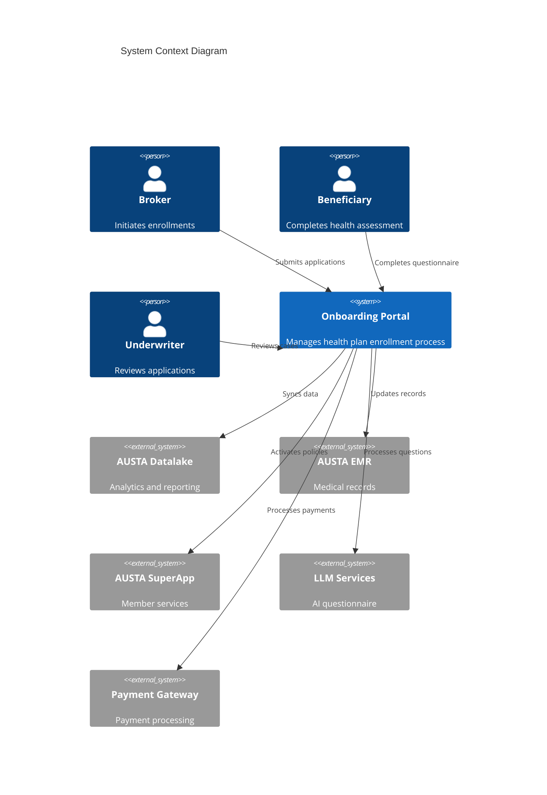
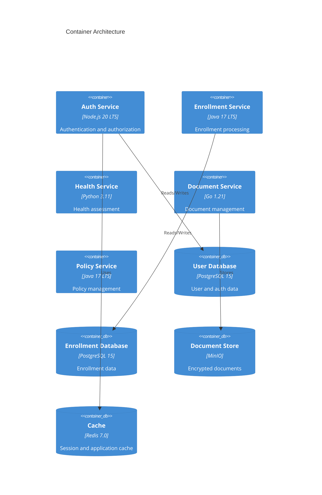
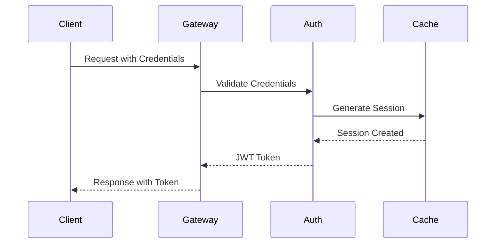

# Pre-paid Health Plan Onboarding Portal - Backend Services

## Table of Contents
- [Architecture Overview](#architecture-overview)
- [Security Implementation](#security-implementation)
- [Development Setup](#development-setup)
- [Production Deployment](#production-deployment)
- [Monitoring & Observability](#monitoring--observability)
- [Troubleshooting](#troubleshooting)

## Architecture Overview

### System Context


### Microservices Architecture


## Security Implementation

### Authentication Flow


### Security Measures
- LGPD Compliance
  - Data encryption at rest (AES-256)
  - Data encryption in transit (TLS 1.3)
  - Strict access controls
  - Audit logging
- Authentication
  - JWT with short expiration (1 hour)
  - Refresh token rotation
  - MFA for sensitive operations
- Authorization
  - Role-based access control (RBAC)
  - Resource-level permissions
  - IP whitelisting for admin access

## Development Setup

### Prerequisites
- Docker Desktop 24.0+
- Node.js 20 LTS
- Java OpenJDK 17
- Python 3.11
- Go 1.21
- kubectl
- helm

### Local Environment Setup
1. Clone the repository
```bash
git clone https://github.com/austa/health-onboarding.git
cd health-onboarding/backend
```

2. Copy environment template
```bash
cp .env.example .env
```

3. Start development environment
```bash
docker-compose -f docker-compose.dev.yml up
```

### Service Ports
- Auth Service: 3000
- Enrollment Service: 8080
- Health Service: 8000
- Document Service: 8001
- Policy Service: 8081

## Production Deployment

### Container Configuration
- Resource Limits
  - Auth Service: 1 CPU, 2Gi Memory
  - Enrollment Service: 2 CPU, 4Gi Memory
  - Health Service: 2 CPU, 4Gi Memory
  - Document Service: 1 CPU, 2Gi Memory
  - Policy Service: 2 CPU, 4Gi Memory

### Deployment Steps
1. Build production images
```bash
docker-compose build
```

2. Push to container registry
```bash
docker-compose push
```

3. Deploy to Kubernetes
```bash
kubectl apply -f kubernetes/
```

## Monitoring & Observability

### Implemented Tools
- Distributed Tracing: Jaeger
- Metrics: Prometheus + Grafana
- Logging: ELK Stack
- APM: New Relic

### Health Checks
- Liveness Probe: /health/live
- Readiness Probe: /health/ready
- Startup Probe: /health/startup

## Troubleshooting

### Common Issues
1. Service Connection Failures
   - Check network policies
   - Verify service discovery
   - Validate credentials

2. Performance Issues
   - Monitor resource usage
   - Check connection pools
   - Verify cache hit rates

3. Authentication Problems
   - Validate token expiration
   - Check CORS settings
   - Verify role assignments

### Support Contacts
- Development Team: dev@austa.com.br
- Operations Team: ops@austa.com.br
- Security Team: security@austa.com.br

## License
Proprietary - AUSTA Healthcare Solutions